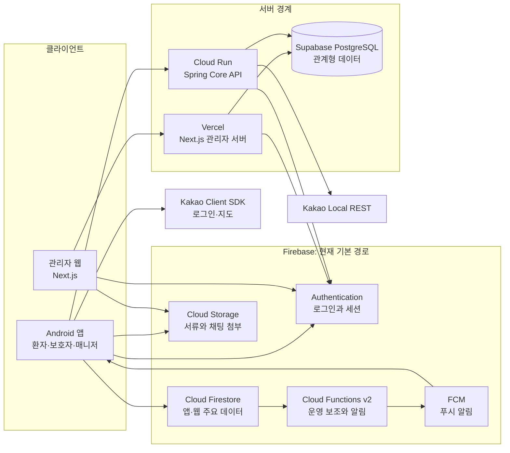

<div align="center">

# 보들 (BoDeul)

**환자·보호자·매니저·운영자를 연결하는 병원 동행 플랫폼**

[](https://github.com/bodeul110/Bodeul/actions/workflows/android-preflight.yml)
[](https://github.com/bodeul110/Bodeul/actions/workflows/core-api.yml)
[](https://github.com/bodeul110/Bodeul/actions/workflows/firebase-rules.yml)
[](https://github.com/bodeul110/Bodeul/actions/workflows/codeql.yml)

[문서 홈](docs/README.md) · [현재 구현 상태](docs/status/implementation-status.md) · [관리자 웹 공유 배포](https://bodeul-admin-web-iota.vercel.app/) · [관리자 웹 저장소](https://github.com/bodeul110/bodeul-admin-web) · [GitHub Issues](https://github.com/bodeul110/Bodeul/issues)

</div>

> [!IMPORTANT]
> 현재 Android 앱의 주요 데이터는 Firebase를 유지하면서 도메인별 PostgreSQL 이전을 진행합니다. 관리자 웹은 별도 `bodeul-admin-web` 저장소의 Next.js/Vercel 경계로 분리됐고, 개발 DB에서 관리자 200·비관리자 403을 실제 검증했습니다. production Google Cloud/Firebase와 Supabase 기반, 배포 권한과 DB migration은 분리했으며, Kakao 운영 키·첫 Cloud Run 배포·Vercel 관리자 DB·App Check·도메인은 출시 게이트로 남아 있습니다.

## 서비스 개요

보들은 병원 동행이 필요한 환자와 보호자, 현장에서 동행을 수행하는 매니저, 서비스 품질을 관리하는 운영자를 하나의 흐름으로 연결합니다.

- 동행 요청, 예약, 매칭, 진행 상태 확인을 하나의 서비스 흐름으로 관리합니다.
- 실시간 위치 공유, 채팅, 첨부파일, 알림으로 동행 중 소통을 지원합니다.
- 매니저 서류 심사, 일정 관리, 동행 기록과 최종 리포트를 제공합니다.
- 관리자 웹과 운영 도구로 심사, 문의, 병원 가이드, 데이터 점검을 처리합니다.
- Firebase의 실시간 기능을 유지하면서 관계형 조회와 운영 이력이 필요한 영역부터 PostgreSQL로 옮깁니다.

## 목차

- [핵심 기능](#핵심-기능)
- [기술 스택](#기술-스택)
- [저장소 구성](#저장소-구성)
- [아키텍처](#아키텍처)
- [API](#api)
- [개발 환경](#개발-환경)
- [실행과 검증](#실행과-검증)
- [설정과 보안](#설정과-보안)
- [배포와 운영](#배포와-운영)
- [주요 문서](#주요-문서)
- [로드맵](#로드맵)

## 핵심 기능

| 영역 | 제공 기능 | 현재 상태 |
| --- | --- | --- |
| 계정과 권한 | 이메일 회원가입·로그인·재설정, 이메일 인증, Google·Kakao 로그인, 역할별 진입 | 구현. Naver 로그인은 코드 경로만 있고 기본 비활성화 |
| 환자·보호자 | 동행 요청 CRUD, 보호자 연결, 진행 상태, 건강 정보 조회, 리포트·리뷰·정산·SOS 후속 흐름 | 구현 |
| 매니저 | 서류 제출·재제출, 심사 상태, 일정, 병원 가이드, 동행 기록, 최종 리포트 | 구현 |
| 실시간 동행 | 위치 공유와 이력, 채팅, 이미지·PDF 첨부, 읽음 처리, FCM 알림 | 구현 |
| 관리자 | 매칭, 진행 요청, 매니저 서류 심사, 병원 가이드, 문의·답변, 운영 액션 확인 | Android 관리자 화면과 관리자 웹에 구현 |
| 운영 자동화 | 예약 알림, Firebase seed·점검·백업·복원·리포트·preflight | 도구 구현. 운영 리허설은 단계별 진행 |
| PostgreSQL 전환 | Firebase ID token 검증, PostgreSQL 관리자 인가, 병원 가이드 조회 API | 1차 실연동 검증 완료, 운영 전환 전 |
| 후속 기능 | OCR 기반 복약 정보, AI 음성 기록 정리, 건강 프로필 영속화 | 기획·로드맵 단계 |

세부 완료 범위와 보류 항목은 [현재 구현 상태](docs/status/implementation-status.md)를 기준으로 확인합니다.

## 기술 스택

| 영역 | 기술 | 역할 |
| --- | --- | --- |
| Android | Java 17, XML, Android SDK 37, Gradle 9.6.1 | 환자·보호자·매니저·관리자 앱 |
| 관리자 웹 | React 19 + Next.js 16 + Vercel, Vite 8 rollback | 서류 심사와 운영 백오피스, 관리자 서버 |
| Core API | Java 21 + Spring Boot + Cloud Run | 사용자 서비스와 Kakao 서버 API, PostgreSQL 접근 경계 |
| Firebase | Authentication, Firestore, Storage, Functions v2, FCM, App Check | 인증, 실시간 데이터, 파일, 푸시와 운영 보조 |
| 관계형 데이터 | Supabase PostgreSQL | 관리자 처리 이력과 관계형 조회의 단계적 이전 대상 |
| 외부 연동 | Kakao Login, Kakao Maps, Kakao Local REST API | 소셜 로그인, 지도와 장소 검색 |
| 배포·자동화 | GitHub Actions, Vercel, Google Cloud Run | CI, 관리자 웹 공유 배포, Core API 컨테이너 배포 |
| 운영 도구 | Firebase CLI, Node.js 스크립트, GitHub Issues/Project | 규칙 검증, seed, 점검, 백업·복원, 작업 추적 |

App Check는 클라이언트와 Core API의 `observe/enforce` 경로까지 준비했습니다. 단계별 강제 순서와 rollback 기준은 확정했지만 release provider와 관리자 웹 검증이 남아 현재는 `observe`를 유지합니다.

## 저장소 구성

| 경로 | 책임 |
| --- | --- |
| `app/` | Java + XML 기반 Android 앱과 역할별 사용자 흐름 |
| `core-api/` | Java 21 + Spring Boot 기반 사용자·매니저 API와 PostgreSQL migration |
| `functions/` | Firebase Functions v2, FCM과 운영 보조 함수 |
| `tools/firebase/` | Firebase seed, 점검, 백업·복원, 리포트, rules 테스트와 preflight |
| `docs/` | 아키텍처, 설계 판단, 운영 절차, 상태와 검증 기록 |
| `.github/workflows/` | Android, Core API, Firebase Rules, migration, CodeQL CI/CD |
| `firestore.rules`, `storage.rules`, `firebase.json` | Firebase 권한과 배포 기준 |

관리자 웹의 source of truth와 CI/CD는 [bodeul110/bodeul-admin-web](https://github.com/bodeul110/bodeul-admin-web)에서 관리합니다. 이 저장소는 Android, Spring Core API, Firebase Rules·Functions와 공용 데이터 계약을 소유합니다. 자세한 소유권은 [관리자 웹 저장소 분리 기록](docs/operations/admin-web-repository-split.md)을 따릅니다.

## 아키텍처



개발 환경에서 관리자 서버와 Core API의 인증·권한·DB 연결을 실제 검증했습니다. 앱 데이터의 source of truth는 도메인별로 전환 중이며, 전체 구성과 전환 근거는 [현재 인프라 구성도](docs/architecture/infra-overview.md)와 [PostgreSQL API 경계](docs/architecture/postgres-api-boundary.md)에 정리돼 있습니다.

운영 목표는 [목표 인프라 구조](docs/architecture/target-infrastructure.md)를 따릅니다. 관리자 브라우저는 Vercel Next.js 관리자 서버를 사용하고, 환자·보호자·매니저 웹과 Android 앱은 Cloud Run Spring Core API를 사용합니다. 두 서버는 서로를 경유하지 않고 공용 Supabase PostgreSQL에 별도 role로 접근합니다.

### 현재 데이터 경계

| 영역 | 현재 source of truth | 전환 판단 |
| --- | --- | --- |
| 인증과 세션 | Firebase Authentication | 유지. API도 Firebase ID token을 검증 |
| 앱 주요 데이터 | Cloud Firestore | 실시간성이 큰 예약·세션·위치는 후순위로 판단 |
| 병원 가이드 | Firestore 기본 경로 + PostgreSQL API 검증 경로 | 응답 비교 후 도메인 단위 전환 |
| 관리자 권한 | Firebase 사용자 역할 + PostgreSQL `app_users.role` | API에서는 두 검증을 모두 통과한 `ADMIN`만 허용 |
| 첨부파일 원본 | Firebase Storage | 원본은 유지하고 메타데이터 이전 여부만 검토 |
| 푸시 알림 | Cloud Functions + FCM | DB 전환과 분리해 유지 |

Firestore와 PostgreSQL이 병행 중이므로 하나의 ERD를 최종 데이터 모델처럼 제시하지 않습니다. PostgreSQL 스키마와 전환 대상은 [PostgreSQL 전환 문서](docs/architecture/postgres-operational-transition.md)에서 관리합니다.

## API

클라이언트는 PostgreSQL에 직접 접속하지 않습니다. 사용자·매니저 요청은 Spring Core API, 관리자 요청은 별도 저장소의 Next.js Route Handler가 담당합니다.

| Method | Endpoint | 인증 | 용도 |
| --- | --- | --- | --- |
| `GET` | `/health` | 없음 | Core API 배포 상태 확인 |
| `GET` | `/api/auth/me` | Firebase ID token | 사용자 인증과 PostgreSQL 역할 확인 |
| `GET` | `/api/places/search` | Firebase ID token | Kakao Local 장소 검색 대행 |
| `GET` | `/admin/hospital-guides?limit=50` | Firebase ID token + PostgreSQL `ADMIN` | Next.js 관리자 서버의 병원 가이드 조회 |

Spring 배포와 환경변수는 [Core API 인프라 런북](docs/operations/core-api-infrastructure-runbook.md), 관리자 경계는 [관리자 웹 구조](docs/architecture/admin-web-architecture.md)를 기준으로 합니다.

## 개발 환경

| 대상 | 기준 환경 |
| --- | --- |
| Android | Android Studio, JDK 17, Android SDK 37 |
| Gradle | Wrapper 9.6.1 사용 |
| Core API | Java 21, Spring Boot, Gradle Wrapper |
| Functions | Node.js 22.x, npm |
| 관리자 웹 | 분리 저장소의 lockfile과 CI 기준, npm |
| Firebase 도구 | `tools/firebase`의 lockfile과 로컬 preflight 기준 |
| 형상·협업 | Git, GitHub CLI, GitHub Issues/Project |

의존성 버전은 각 모듈의 lockfile과 Gradle version catalog를 기준으로 하며, 별도 검토 없이 일괄 업그레이드하지 않습니다.

## 실행과 검증

### Android

```powershell
.\gradlew.bat assembleDebug --console=plain
.\gradlew.bat testDebugUnitTest --console=plain
```

### Core API

```powershell
.\core-api\gradlew.bat -p core-api check --console=plain
.\core-api\gradlew.bat -p core-api bootRun --console=plain
```

기본 주소는 `http://127.0.0.1:8080`이며, 데이터베이스와 인증 설정은 [Core API 인프라 런북](docs/operations/core-api-infrastructure-runbook.md)의 환경변수 표를 따릅니다.

### 관리자 웹

```powershell
git clone git@github.com:bodeul110/bodeul-admin-web.git
cd bodeul-admin-web
npm ci
npm run test
npm run lint
npm run build
```

새 관리자 웹 작업은 [분리 저장소](https://github.com/bodeul110/bodeul-admin-web)의 PR과 현재 source of truth 전환 상태를 먼저 확인합니다.

### Firebase 운영 도구

```powershell
npm --prefix tools/firebase ci
npm --prefix tools/firebase run preflight:local
```

운영 데이터에 쓰는 명령은 dry-run과 대상 프로젝트 확인을 먼저 수행합니다. 명령별 사용 시점은 [Firebase 운영 문서](docs/operations/firebase/setup.md)를 확인합니다.

## 설정과 보안

| 대상 | 로컬 설정 | 원칙 |
| --- | --- | --- |
| Android | `local.properties`, `google-services.json` | 로컬에서만 관리하고 커밋하지 않음 |
| Core API | DB URL, Firebase project, Kakao Secret Manager 참조 | Cloud Run과 GitHub Environment의 서버 전용 설정으로만 주입 |
| 관리자 웹 | 별도 저장소 `.env.example` 기준 공개 `NEXT_PUBLIC_*`와 서버 전용 `ADMIN_DATABASE_URL` 분리 | 실제 환경값과 DB 자격 증명을 소스나 브라우저 번들에 작성하지 않음 |
| Firebase | 서비스 계정 키, CLI token, App Check debug token | 공개 Issue·PR·로그에 남기지 않음 |

테스트 계정과 seed 데이터는 공개 README에 비밀번호를 적지 않고 [내부 테스트 가이드](docs/operations/internal-test-guide.md)에서 환경별로 관리합니다.

## 배포와 운영

| 대상 | 현재 방식 | 상태 |
| --- | --- | --- |
| Android | GitHub Actions `Android Preflight`, 로컬 debug build | 배포 전 컴파일·테스트 검증 |
| 관리자 웹 | 별도 저장소의 Next.js Vercel 배포 + Vite rollback | Preview에서 401·403·200과 개발 DB 조회를 검증. production Firebase 앱과 DB role은 준비했지만 Vercel 운영 자격 증명은 미설정 |
| Core API | Cloud Run Spring + Supabase PostgreSQL + Firebase 인증 | Preview 실검증과 production Artifact Registry·WIF·DB migration 완료. Kakao 운영 키와 첫 production revision은 미배포 |
| Firebase | `bodeul-dev`, `bodeul-prod-110`, Rules·Functions·FCM·Storage | dev/prod 프로젝트 분리와 production Rules 배포 완료. release provider와 App Check 강제는 후속 |

Vercel의 기본 도메인은 현재 개발·공유 검증용입니다. Preview에만 관리자 DB 자격 증명을 두었고 production에는 넣지 않았습니다. production 프로젝트 생성 완료와 실제 서비스 출시는 구분하며, 남은 전환 조건은 [관리자 웹 환경 기준](docs/operations/admin-web-environments.md)과 [production 인프라 구축 기록](docs/reports/production-infrastructure-bootstrap-2026-07-17.md)에서 추적합니다.

## 주요 문서

| 문서 | 내용 |
| --- | --- |
| [문서 홈](docs/README.md) | 전체 문서 구조와 기준 |
| [현재 구현 상태](docs/status/implementation-status.md) | 역할별 완료 기능과 남은 범위 |
| [현재 인프라 구성도](docs/architecture/infra-overview.md) | Firebase, API, PostgreSQL, 배포 흐름 |
| [Android 앱 구조](docs/architecture/app-architecture.md) | Activity, Coordinator, Binder, Repository 역할 |
| [관리자 웹 구조](docs/architecture/admin-web-architecture.md) | 백오피스 역할, 권한과 데이터 접근 |
| [PostgreSQL API 경계](docs/architecture/postgres-api-boundary.md) | Firebase와 PostgreSQL 혼용·전환 기준 |
| [Production 인프라 기본값](docs/operations/production-infrastructure-defaults.md) | 운영 리소스 식별자, 배포·권한·백업 기준 |
| [Production 인프라 구축 기록](docs/reports/production-infrastructure-bootstrap-2026-07-17.md) | 실제 생성·migration 검증과 남은 출시 게이트 |
| [설계 판단 기록](docs/architecture/decision-log.md) | 목적, 대안, 선택 이유와 리스크 기록 규칙 |
| [내부 테스트 가이드](docs/operations/internal-test-guide.md) | 역할별 테스트와 seed 사용 방법 |
| [협업 규칙](docs/operations/collaboration-rules.md) | 브랜치, PR, 검증과 문서화 절차 |

## 로드맵

- 병원 가이드에서 검증한 API 경계를 관리자 조회 도메인부터 단계적으로 확장합니다.
- Spring Core API와 Next.js 관리자 서버에서 검증한 경계를 도메인별로 확장합니다.
- Kakao 운영 키를 등록하고 첫 Cloud Run production revision의 인증·DB·rollback을 검증합니다.
- Vercel Production에 production Firebase와 SELECT-only 관리자 DB 자격 증명을 연결합니다.
- release 서명·Google 로그인, App Check provider/enforcement와 authorized domain을 검증합니다.
- production DB 복원 리허설과 일일 백업 보호 수준, 운영자·출시 일정을 확정합니다.
- 전환 도메인마다 Firestore·PostgreSQL 응답 비교, rollback 기준과 write 소유권을 문서화합니다.
- 데이터와 서버 경계가 안정된 뒤 OCR 복약 정보와 AI 음성 기록 정리를 구현합니다.

작업 우선순위와 진행 상태는 [GitHub Issues](https://github.com/bodeul110/Bodeul/issues)와 `BoDeul 작업 백로그`를 기준으로 관리합니다.
