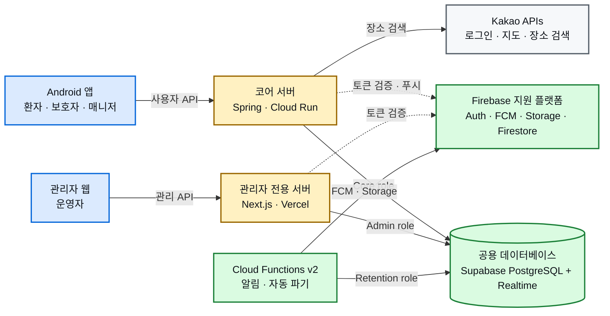

<div align="center">

# 보들 (BoDeul)

**환자·보호자·매니저·운영자를 연결하는 병원 동행 플랫폼**

[](https://github.com/bodeul110/Bodeul/actions/workflows/android-preflight.yml)
[](https://github.com/bodeul110/Bodeul/actions/workflows/core-api.yml)
[](https://github.com/bodeul110/Bodeul/actions/workflows/firebase-rules.yml)
[](https://github.com/bodeul110/Bodeul/actions/workflows/codeql.yml)

[문서](docs/README.md) · [아키텍처](docs/architecture/infra-overview.md) · [관리자 웹 저장소](https://github.com/bodeul110/bodeul-admin-web) · [이슈](https://github.com/bodeul110/Bodeul/issues)

</div>

## 프로젝트 소개

보들은 병원 방문에 도움이 필요한 환자와 보호자에게 검증된 동행 매니저를 연결하고, 예약부터 동행 종료까지의 과정을 하나의 흐름으로 관리하는 서비스입니다. Android 앱은 환자·보호자·매니저의 현장 경험을 제공하고, 별도 관리자 웹은 심사와 매칭, 문의 대응 등 운영 업무를 담당합니다.

| 사용자 | 주요 경험 |
| --- | --- |
| 환자 | 동행 요청, 일정 확인, 위치·채팅 공유, 동행 리포트 확인 |
| 보호자 | 환자 연결, 대신 예약, 동행 진행 확인, 후기와 후속 처리 |
| 매니저 | 자격 서류 제출, 일정 관리, 동행 수행, 최종 리포트 작성 |
| 운영자 | 매니저 심사, 매칭 관리, 문의 처리, 병원 가이드와 운영 데이터 관리 |

## 핵심 기능

| 영역 | 기능 |
| --- | --- |
| 계정과 권한 | 이메일·소셜 로그인, 이메일 인증, 환자·보호자·매니저·관리자 역할 분리 |
| 예약과 매칭 | 동행 요청, 일정 조율, 매니저 배정, 진행 상태와 후속 처리 |
| 실시간 동행 | 위치 공유, 채팅, 읽음 처리, 이미지·PDF 첨부, FCM 알림 |
| 매니저 업무 | 자격 서류 심사, 일정과 병원 가이드, 동행 기록, 최종 리포트 |
| 관리자 운영 | 매칭, 심사, 문의·답변, 병원 가이드, 민감정보 보호와 감사 흐름 |
| 운영 자동화 | 데이터 점검, seed, 백업·복원, 보관 기간에 따른 자동 파기 |

## 서비스 구조

관리자 웹과 사용자 앱은 서로 다른 서버 경계를 사용하지만 같은 PostgreSQL을 바라봅니다. 각 서버는 독립된 최소 권한 DB role을 사용하며, 클라이언트는 데이터베이스에 직접 연결하지 않습니다.



### 데이터 책임

| 데이터 | 기준 시스템 |
| --- | --- |
| 로그인과 사용자 세션 | Firebase Authentication |
| 예약·매칭·동행·채팅·위치·리포트 | Supabase PostgreSQL |
| 실시간 변경 알림 | Supabase Realtime private Broadcast |
| 첨부파일과 증빙 원본 | Firebase Storage |
| 푸시 알림 | Firebase Cloud Messaging |
| Firebase 결합 프로필·지원·서류 | Cloud Firestore |
| 장소 검색 | Spring Core API를 통한 Kakao Local REST API |

설계 배경과 세부 요청 흐름은 [인프라 구성](docs/architecture/infrastructure.md), [데이터 및 API 계약](docs/architecture/data-api.md), [목표 인프라 구조](docs/architecture/target-infrastructure.md)에서 확인할 수 있습니다.

## 기술 스택

| 영역 | 기술 |
| --- | --- |
| Android | Java 17, XML, Android SDK 37, Firebase Android SDK, Kakao SDK |
| Core API | Java 21, Spring Boot 3.5.16, Spring Security, JDBC, Flyway |
| 관리자 웹 | TypeScript, React 19, Next.js 16, Tailwind CSS 4, Vercel |
| 데이터 | PostgreSQL 17, Supabase, Supabase Realtime |
| Firebase | Authentication, Firestore, Storage, Functions v2, FCM, App Check |
| 인프라 | Google Cloud Run, Artifact Registry, Secret Manager, WIF |
| CI·운영 | GitHub Actions, Firebase CLI, Node.js 22 운영 도구 |

## 저장소 구성

```text
Bodeul/
├─ app/                    Android 앱
├─ core-api/               Spring Core API와 Flyway migration
├─ functions/              Firebase Functions v2
├─ tools/firebase/         seed, 점검, 백업·복원, 운영 리포트
├─ docs/                   설계, 운영, 보안, 검증 문서
├─ .github/workflows/      CI/CD와 수동 운영 workflow
├─ firestore.rules         Firestore 권한 규칙
├─ storage.rules           Storage 권한 규칙
└─ firebase.json           Firebase 배포 설정
```

관리자 UI, Next.js 서버와 Vercel 배포는 별도 [bodeul-admin-web](https://github.com/bodeul110/bodeul-admin-web) 저장소에서 관리합니다. 이 저장소는 Android 앱, Core API, 공용 데이터 계약, Firebase Rules·Functions를 소유합니다.

## 개발 시작

### 요구 환경

| 대상 | 요구 사항 |
| --- | --- |
| Android | Android Studio, JDK 17, Android SDK 37 |
| Core API | JDK 21 |
| Functions·운영 도구 | Node.js 22, npm |
| Firebase 작업 | Firebase CLI |

### 기본 검증

```powershell
# Android
.\gradlew.bat assembleDebug --console=plain

# Core API
.\core-api\gradlew.bat -p core-api check --console=plain

# Firebase Functions
npm --prefix functions ci
npm --prefix functions test

# Firebase 운영 도구
npm --prefix tools/firebase ci
npm --prefix tools/firebase run preflight:local
```

`google-services.json`, `local.properties`, DB 접속 정보, API key와 서비스 계정 key는 저장소에 커밋하지 않습니다. 역할별 테스트와 환경 설정은 [내부 테스트 가이드](docs/operations/internal-test-guide.md)와 [Core API 인프라 런북](docs/operations/core-api-infrastructure-runbook.md)을 따릅니다.

## 문서

| 문서 | 내용 |
| --- | --- |
| [문서 홈](docs/README.md) | 프로젝트 문서 전체 색인 |
| [Android 앱 구조](docs/architecture/app-architecture.md) | Activity, Coordinator, Binder, Repository 책임 |
| [인프라 구성](docs/architecture/infrastructure.md) | 서버, 데이터, 인증, 배포 경계 |
| [데이터 및 API 계약](docs/architecture/data-api.md) | 도메인 데이터와 API 기준 |
| [보안 문서](docs/security/README.md) | 권한, Rules, App Check와 보안 원칙 |
| [협업 규칙](docs/operations/collaboration-rules.md) | 브랜치, PR, 검증과 문서화 방식 |

작업은 [GitHub Issues](https://github.com/bodeul110/Bodeul/issues)와 `BoDeul 작업 백로그`에서 관리합니다.
