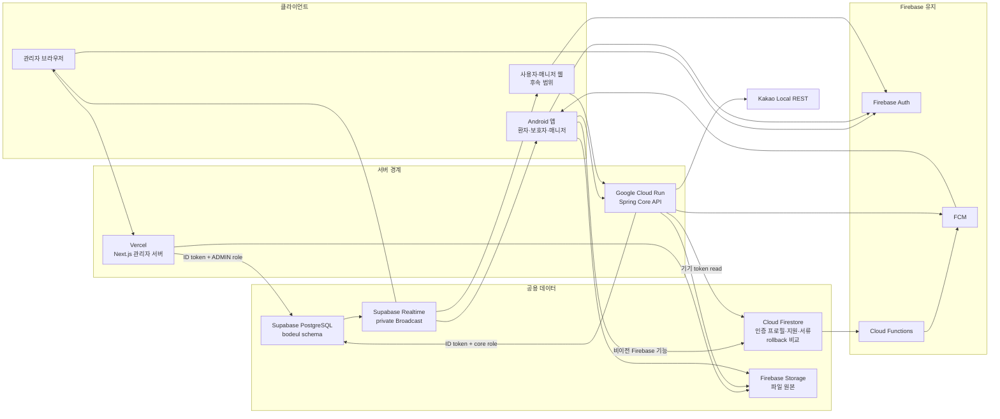

# 현재 인프라 구성도

기준일: 2026-07-19

초기에는 빠른 구현을 우선했기 때문에 모든 선택 근거가 사전에 정리되지는 않았다.
현재는 구현된 구조를 기준으로 선택 이유, 대안, 단점, 전환 조건을 정리하고 있다.

## 한 줄 결론

개발과 production 인프라는 `Vercel Next.js 관리자 서버 + Cloud Run Spring Core API + 공용 Supabase PostgreSQL + Supabase Realtime + Firebase Auth/FCM/App Check/Storage` 경계로 분리했다. production 프로젝트, DB migration과 복원 기반은 생성했지만 사용자 업무 쓰기, 관리자 production DB, Kakao key, release App Check와 도메인은 아직 전환하지 않았다.

## 구성도

## 현재 구현 상태

| 경계 | 현재 상태 | 검증 |
| --- | --- | --- |
| 관리자 웹 | 별도 `bodeul-admin-web` 저장소, Next.js, Vercel | Preview 루트 200, 무인증 401, 비관리자 403, 관리자 200과 DB 조회 확인 |
| 관리자 DB 접속 | `bodeul_admin_service`, transaction pooler, 최대 연결 5 | Preview 전용 자격 증명과 Supabase Root CA 검증, 쓰기 권한 없음 확인 |
| 사용자 Core API | `core-api/`, Java 21, Spring Boot, Cloud Run Tokyo | `/health` 200, Firebase token, PostgreSQL role, App Check observe, rollback, 실세션 API와 FCM 확인 |
| Kakao Local | Core API의 `/api/places/search` 뒤에 배치 | Android 직접 REST 키 제거, 인증된 실제 호출 확인 |
| 공용 DB | 개발·production Supabase PostgreSQL을 Tokyo에 분리 | production Flyway V1~V13, 최종 격리 복원 manifest 일치, 전용 role·RLS·공개 grant 0건, Security Advisor 경고 0건 |
| 실시간 | Supabase Realtime private Broadcast | 실제 참여·비참여 인가, 재연결, 10개 동시 join과 Broadcast 10/10 수신 확인 |
| Firebase | 개발·production Auth, Firestore, Storage를 분리 | production Rules 배포, Firestore 삭제 방지, App Check는 미강제 |

## 저장소 소유권

| 저장소 | 소유 범위 |
| --- | --- |
| `bodeul110/Bodeul` | Android, Spring Core API, DB migration, Firebase Rules·Functions, 공용 계약과 운영 문서 |
| `bodeul110/bodeul-admin-web` | Next.js 관리자 UI·서버, Vercel 배포, Vite rollback, 관리자 전용 문서와 CI |

기존 메인 저장소의 `api/` Node 프로토타입과 `admin-web/` 중복본은 대체 계약의 실제 검증 후 제거했다. 종료 근거는 [Issue 159 기록](../reports/issue-159-node-api-retirement-audit-2026-07-16.md)에 남긴다.

## 데이터 source of truth

| 도메인 | 현재 기준 | 전환 원칙 |
| --- | --- | --- |
| 인증 | Firebase Auth | 유지하고 두 서버가 ID token을 검증한다. |
| 예약·세션·채팅·읽음·위치·리포트·후속 처리 | 개발 PostgreSQL | Android는 Core API로만 쓰고 Realtime 이벤트 뒤 API snapshot을 다시 읽는다. |
| 인증 프로필·지원·매니저 서류 | Firestore | Firebase 결합 기능으로 유지하며 PostgreSQL 업무 원본과 섞어 쓰지 않는다. |
| 기존 예약·세션 문서 | Firestore rollback 비교 자료 | client 업무 쓰기를 차단하고 전환 결과 비교와 제한적 조회에만 사용한다. |
| 병원 가이드 관리자 조회 | PostgreSQL | Next.js 관리자 서버를 통해 읽는다. |
| 예약 요청 read model | 개발 PostgreSQL | Android와 관리자 웹은 각 서버 API를 통해 같은 PostgreSQL 상태를 읽는다. 기존 Firestore 문서는 rollback 비교 자료다. |
| 역할·관계형 운영 데이터 | PostgreSQL | 서버별 최소 권한 role을 사용한다. |
| 파일 원본 | Firebase Storage | 메타데이터만 PostgreSQL 이전을 검토한다. |
| 푸시 | Core API + FCM, Firebase 기능은 Functions + FCM | 채팅·위치는 Core commit 결과로 보내고 예약·지원 등 Firebase 결합 알림은 Functions가 처리한다. |
| 실시간 화면 갱신 | Supabase Realtime private Broadcast | PostgreSQL 커밋 뒤 변경 신호만 보내고 재연결 시 Core API snapshot을 다시 조회한다. |

## 남은 운영 전환

- Vercel Production에 production Firebase와 SELECT-only 관리자 DB 값을 등록하고 Cloud Run 첫 승인을 배포한다.
- 관리자 웹 custom domain, Auth authorized domain, App Check enforcement와 live 승인 조건을 확정한다.
- 개발에서 전환한 예약·매칭·동행·채팅·위치 domain을 production migration과 함께 재검증한다.
- Cloud Run과 Vercel rollback을 실제 격리 환경에서 검증한다. PostgreSQL restore는 2026-07-18 완료했다.
- 2026-11-16까지 Supabase와 Vercel을 Pro로 전환하고 2026-12-15 Go/No-Go를 수행한다.

이 항목은 구현 미완료와 운영 의사결정을 구분한다. 현재 개발 경계의 인증·인가·DB 연결과 production 복원은 검증됐지만 production 트래픽 전환 완료를 뜻하지 않는다.

## 관련 문서

- [목표 인프라 구조](target-infrastructure.md)
- [시스템 아키텍처 다이어그램](system-architecture-diagram.md)
- [PostgreSQL API 경계](postgres-api-boundary.md)
- [Spring Core API 인프라 런북](../operations/core-api-infrastructure-runbook.md)
- [관리자 웹 저장소 분리 기록](../operations/admin-web-repository-split.md)
