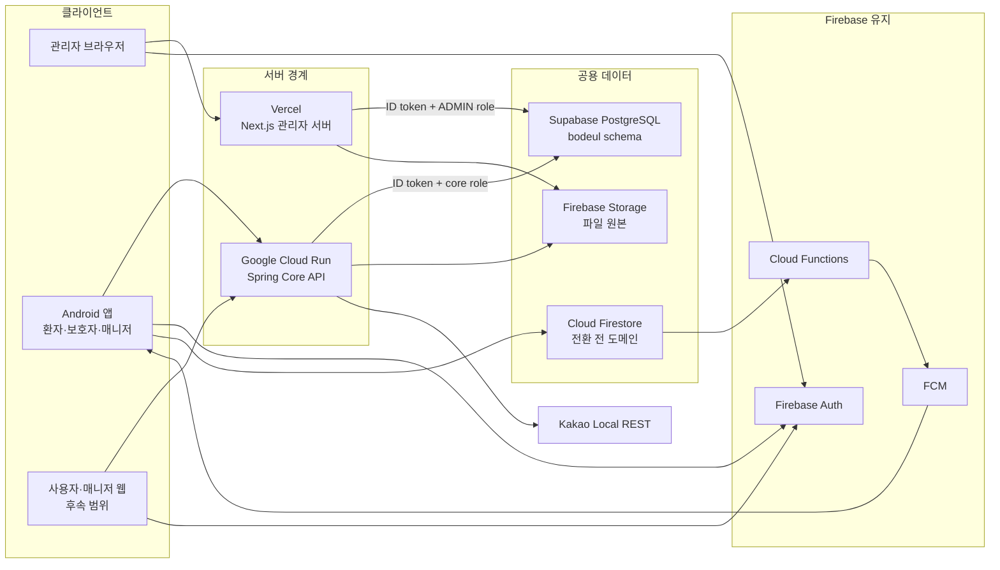

# 현재 인프라 구성도

기준일: 2026-07-17

초기에는 빠른 구현을 우선했기 때문에 모든 선택 근거가 사전에 정리되지는 않았다.
현재는 구현된 구조를 기준으로 선택 이유, 대안, 단점, 전환 조건을 정리하고 있다.

## 한 줄 결론

개발과 production 인프라는 `Vercel Next.js 관리자 서버 + Cloud Run Spring Core API + 공용 Supabase PostgreSQL + Firebase Auth/FCM/Storage` 경계로 분리했다. production 프로젝트와 DB migration 기반은 생성했지만 사용자 트래픽, 관리자 DB 연결, Kakao key, App Check와 도메인은 아직 전환하지 않았다.

## 구성도

## 현재 구현 상태

| 경계 | 현재 상태 | 검증 |
| --- | --- | --- |
| 관리자 웹 | 별도 `bodeul-admin-web` 저장소, Next.js, Vercel | Preview 루트 200, 무인증 401, 비관리자 403, 관리자 200과 DB 조회 확인 |
| 관리자 DB 접속 | `bodeul_admin_service`, transaction pooler, 최대 연결 5 | Preview 전용 자격 증명과 Supabase Root CA 검증, 쓰기 권한 없음 확인 |
| 사용자 Core API | `core-api/`, Java 21, Spring Boot, Cloud Run Tokyo | `/health` 200, Firebase token, PostgreSQL role, App Check observe, rollback 확인 |
| Kakao Local | Core API의 `/api/places/search` 뒤에 배치 | Android 직접 REST 키 제거, 인증된 실제 호출 확인 |
| 공용 DB | 개발·production Supabase PostgreSQL을 Tokyo에 분리 | production Flyway V1~V3, role·RLS·공개 grant 0건, Security Advisor 경고 0건 |
| Firebase | 개발·production Auth, Firestore, Storage를 분리 | production Rules 배포, Firestore 삭제 방지, App Check는 미강제 |

## 저장소 소유권

| 저장소 | 소유 범위 |
| --- | --- |
| `bodeul110/Bodeul` | Android, Spring Core API, DB migration, Firebase Rules·Functions, 공용 계약과 운영 문서 |
| `bodeul110/bodeul-admin-web` | Next.js 관리자 UI·서버, Vercel 배포, Vite rollback, 관리자 전용 문서와 CI |

기존 메인 저장소의 `api/` Node 프로토타입과 `admin-web/` 중복본은 대체 계약의 실제 검증 후 제거했다. 종료 근거는 [Issue 159 기록](../reports/issue-159-node-api-retirement-audit-2026-07-16.md)에 남긴다.

## 데이터 source of truth

| 도메인 | 현재 기준 | 전환 원칙 |
| --- | --- | --- |
| 인증 | Firebase Auth | 유지하고 두 서버가 ID token을 검증한다. |
| 예약·세션·위치 등 앱 데이터 | Firestore | 백필, 결과 비교, rollback이 끝난 도메인부터 PostgreSQL로 전환한다. |
| 병원 가이드 관리자 조회 | PostgreSQL | Next.js 관리자 서버를 통해 읽는다. |
| 예약 요청 read model | Firestore 원본 + PostgreSQL read model | 현재는 검증 단계이며 Android 쓰기 기준은 Firestore다. |
| 역할·관계형 운영 데이터 | PostgreSQL | 서버별 최소 권한 role을 사용한다. |
| 파일 원본 | Firebase Storage | 메타데이터만 PostgreSQL 이전을 검토한다. |
| 푸시 | Functions + FCM | DB 전환과 분리해 유지한다. |

## 남은 운영 전환

- Vercel Production에 production Firebase와 SELECT-only 관리자 DB 값을 등록하고 Cloud Run 첫 승인을 배포한다.
- 관리자 웹 custom domain, Auth authorized domain, App Check enforcement와 live 승인 조건을 확정한다.
- 예약, 매칭, 동행 세션 등 도메인별 PostgreSQL source of truth 전환을 리허설한다.
- 비공개 pre-migration dump를 이용해 production restore와 장애 rollback을 실제 격리 환경에서 검증한다.

이 항목은 구현 미완료와 운영 의사결정을 구분한다. 현재 개발 경계의 인증·인가·DB 연결은 검증됐지만 production 준비 완료를 뜻하지 않는다.

## 관련 문서

- [목표 인프라 구조](target-infrastructure.md)
- [시스템 아키텍처 다이어그램](system-architecture-diagram.md)
- [PostgreSQL API 경계](postgres-api-boundary.md)
- [Spring Core API 인프라 런북](../operations/core-api-infrastructure-runbook.md)
- [관리자 웹 저장소 분리 기록](../operations/admin-web-repository-split.md)
