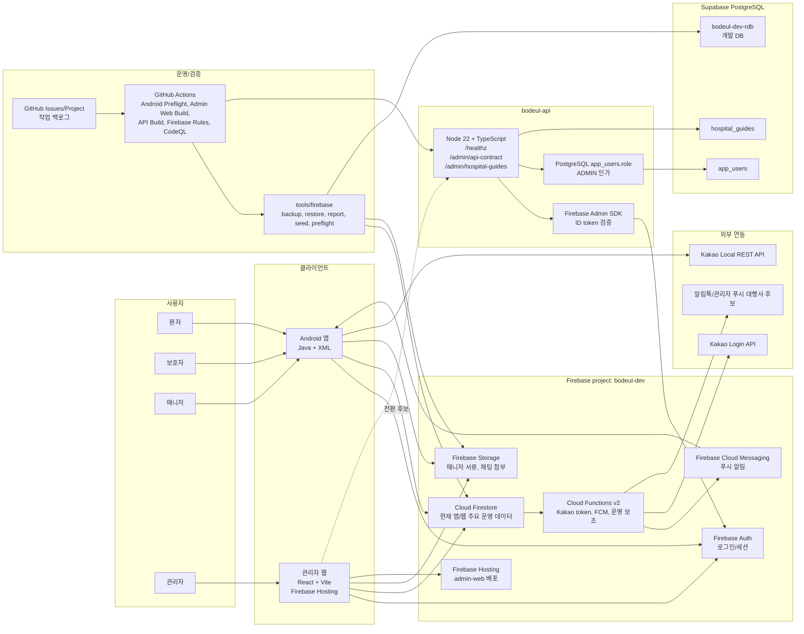

# 현재 인프라 구성도

기준일: 2026-07-02

초기에는 빠른 구현을 우선했기 때문에 모든 선택 근거가 사전에 정리되지는 않았다.
현재는 구현된 구조를 기준으로 선택 이유, 대안, 단점, 전환 조건을 정리하고 있다.

이 문서는 다음 회의에서 한 장으로 설명할 현재 BoDeul 인프라 구성도다. 자세한 런타임 설명은 [인프라 개요](infrastructure.md), PostgreSQL 전환 기준은 [PostgreSQL 운영 전환 결정](postgres-operational-transition.md), API 경계는 [PostgreSQL API 경계 기준](postgres-api-boundary.md)을 기준으로 본다.

## 한 줄 결론

현재 운영 기준은 `Firebase 인프라 유지 + Supabase PostgreSQL 전환 준비 + bodeul-api 얇은 서버 경계 도입`이다.

- Android 앱과 관리자 웹의 기존 운영 화면은 아직 Firebase Auth, Firestore, Storage를 직접 사용한다.
- Supabase PostgreSQL 개발 DB는 seed 적용과 row count/FK 점검이 끝난 상태다.
- `bodeul-api`는 Node 22 + TypeScript 기반으로 추가됐고, Firebase ID token 검증, PostgreSQL 연결, `ADMIN` role 인가, 병원 가이드 read API까지 구현됐다.
- 관리자 웹은 기본값을 `firebase`로 유지한다. 다만 `VITE_BODEUL_DATA_BACKEND=api` 환경에서는 병원 가이드 검증 화면이 `bodeul-api`를 호출할 수 있다.

## 한 장 구성도

## 현재 source of truth

| 영역 | 현재 기준 | 전환 상태 |
| --- | --- | --- |
| 인증 | Firebase Auth | 유지. `bodeul-api`도 Firebase ID token을 검증한다. |
| 앱 주요 데이터 | Firestore | Android 기본 경로는 유지한다. 예약/세션/위치처럼 실시간성이 큰 영역은 마지막에 전환 여부를 판단한다. |
| 관리자 웹 주요 데이터 | Firestore + Storage | 기본 화면은 아직 Firebase 직접 접근이다. API 전환은 병원 가이드 read API부터 검증한다. |
| 병원 가이드 | PostgreSQL 전환 검증 | `GET /admin/hospital-guides`가 PostgreSQL `hospital_guides`를 읽고, 관리자 웹 병원 가이드 메뉴가 `api` 모드에서 이 응답을 표시한다. |
| 관리자 권한 | Firebase Auth + PostgreSQL `app_users.role` | API 경계에서는 `ADMIN` role만 허용한다. 기존 Firebase/Firestore 관리자 경로와 병행 기간이 있다. |
| 파일 원본 | Firebase Storage | 매니저 서류와 채팅 첨부 원본은 Storage 유지. 메타데이터만 PostgreSQL 전환 후보. |
| 푸시/알림 | FCM + Functions | DB 전환과 분리해서 유지한다. |
| 관리자 웹 배포 | Firebase Hosting | `bodeul-dev.web.app` 기준. preview는 GitHub Actions WIF 경로로 유지한다. |
| 운영 DB 후보 | Supabase PostgreSQL | `bodeul-dev-rdb` 개발 DB seed 검증 완료. 운영 DB는 개발 리허설 후 생성한다. |

## GitHub 반영 근거

2026-07-02 현재 `master`에 다음 인프라 관련 PR이 병합됐다.

| PR | 반영 내용 | 현재 문서 판단 |
| --- | --- | --- |
| [#89](https://github.com/bodeul110/Bodeul/pull/89) | PostgreSQL 운영 전환 기준 문서화 | Firebase 전체 교체가 아니라 혼용 전환으로 정리 |
| [#90](https://github.com/bodeul110/Bodeul/pull/90) | Firebase/PostgreSQL 혼용 전환 계획 명확화 | Auth, FCM, Storage, Hosting은 Firebase 유지 |
| [#91](https://github.com/bodeul110/Bodeul/pull/91) | Supabase DB 준비 담당 기준 명확화 | DB 생성/secret 입력은 담당자 실행 범위 |
| [#101](https://github.com/bodeul110/Bodeul/pull/101) | Supabase 개발 DB seed 검증 기준 추가 | `bodeul-dev-rdb` seed, row count, FK 점검 근거 반영 |
| [#109](https://github.com/bodeul110/Bodeul/pull/109) | `bodeul-api` 서버 골격 추가 | API 경계가 코드로 생성됨 |
| [#114](https://github.com/bodeul110/Bodeul/pull/114) | Firebase Admin SDK 인증 연결 | API 서버가 Firebase ID token을 검증할 수 있음 |
| [#115](https://github.com/bodeul110/Bodeul/pull/115) | PostgreSQL client 초기화 | `DATABASE_URL` 기반 `pg` pool 사용 |
| [#116](https://github.com/bodeul110/Bodeul/pull/116) | 관리자 role 기반 인가 추가 | `app_users.firebase_uid`와 `ADMIN` role 기준 |
| [#117](https://github.com/bodeul110/Bodeul/pull/117) | 병원 가이드 read API 추가 | 첫 PostgreSQL read API 구현 완료 |
| [#121](https://github.com/bodeul110/Bodeul/pull/121) | 관리자 웹 병원 가이드 API 연결 | `api` 모드에서 관리자 웹이 병원 가이드 read API를 호출 |

GitHub Actions 기준으로 최근 `API Build`, `Admin Web Build`, `Android Preflight`, `CodeQL`은 PR #121 병합 시점에 통과했다. Code scanning open alert는 2026-07-02 확인 기준 0건이다.

## 남은 운영 판단

| GitHub 이슈 | 남은 판단 |
| --- | --- |
| [#122](https://github.com/bodeul110/Bodeul/issues/122) | 관리자 웹 API 환경변수와 CORS origin 설정을 환경별로 확정한다. |
| [#123](https://github.com/bodeul110/Bodeul/issues/123) | 병원 가이드 Firestore/API 응답 비교 기록을 남긴다. |
| [#32](https://github.com/bodeul110/Bodeul/issues/32) | App Check 강제 적용과 Firebase 환경 분리 계획 확정 |
| [#64](https://github.com/bodeul110/Bodeul/issues/64) | 격리 환경에서 `restore:state:apply`까지 포함한 백업/복원 리허설 |
| [#65](https://github.com/bodeul110/Bodeul/issues/65) | Firebase 비용 모니터링과 예산 알림 설정 |
| [#66](https://github.com/bodeul110/Bodeul/issues/66) | Kakao Local REST API key 운영 리스크 점검 |
| [#74](https://github.com/bodeul110/Bodeul/issues/74) | 관리자 웹 별도 레포 분리 기준 확정 |
| [#103](https://github.com/bodeul110/Bodeul/issues/103) | `uuid` 전이 취약점 업데이트 범위 검토 |

## 설명 포인트

- 현재 MVP 규모에서는 Firebase가 Auth, FCM, Storage, Hosting, Functions를 맡는 것이 운영 부담 기준으로 유리하다.
- 관계형 조회, 운영 감사, 정산, 통계, 관리자 처리 이력처럼 Firestore보다 RDBMS가 설명하기 쉬운 영역은 Supabase PostgreSQL로 옮긴다.
- 클라이언트가 Supabase에 직접 붙지 않고 `bodeul-api`를 통하는 이유는 DB secret, Firebase token 검증, 관리자 권한 검증을 서버에서 통제하기 위해서다.
- 전환은 도메인별로 진행한다. 특정 도메인을 PostgreSQL source of truth로 바꾸기 전에는 Firestore와 PostgreSQL 결과 비교, rollback 기준, write 경계가 문서화되어야 한다.
