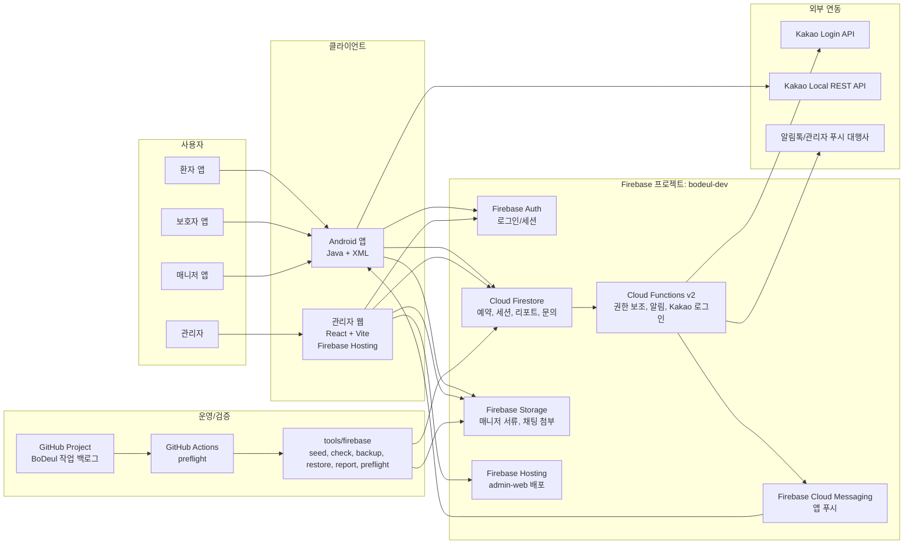

# 현재 인프라 구성도

기준일: 2026-06-25

초기에는 빠른 구현을 우선했기 때문에 모든 선택 근거가 사전에 정리되지는 않았다.
현재는 구현된 구조를 기준으로 선택 이유, 대안, 단점, 전환 조건을 정리하고 있다.

이 문서는 다음 회의에서 한 장으로 설명할 현재 BoDeul 인프라 구성도다. 자세한 런타임 설명은 [인프라 개요](infrastructure.md), 상세 흐름은 [시스템 아키텍처 다이어그램](system-architecture-diagram.md)을 기준으로 본다.

2026-06-26 이후 운영 source of truth는 PostgreSQL과 서버 API로 전환하기로 결정했다. 이 문서는 전환 전 현재 구조를 설명하는 기준이고, 전환 목표 구조는 [PostgreSQL 운영 전환 결정](postgres-operational-transition.md)을 기준으로 본다.

## 한 장 구성도

## 현재 선택한 방식

- 별도 상시 백엔드 서버 없이 Firebase 중심 BaaS 구조를 사용한다.
- Android 앱과 관리자 웹이 같은 Firebase project의 Auth, Firestore, Storage 계약을 공유한다.
- 서버에서만 처리해야 하는 Kakao 로그인 custom token 발급, 알림 큐, 관리자 수동 실행은 Cloud Functions에 둔다.
- 관리자 웹은 Firebase Hosting으로 배포하고, 현재 live URL은 <https://bodeul-dev.web.app>이다.
- 운영 점검과 seed, 백업/복원, 리포트는 `tools/firebase` Node 스크립트로 분리한다.

## 대안

| 대안 | 장점 | 현재 보류 이유 |
| --- | --- | --- |
| Spring/Node API 서버 + RDB | 권한과 도메인 로직을 서버에 집중할 수 있다. | 현재 MVP 규모에서는 서버 운영, 배포, 장애 대응 부담이 크다. |
| Supabase/PostgreSQL | SQL, RLS, Realtime을 함께 쓸 수 있다. | 현재 앱과 운영 도구가 Firebase Auth/Firestore/Storage/Functions에 이미 맞춰져 있다. |
| Firebase App Hosting | 최신 웹 앱 배포 흐름을 쓸 수 있다. | 현재 관리자 웹은 정적 Vite SPA라 Firebase Hosting이 더 단순하다. |

## 리스크와 전환 조건

- Firestore 읽기/쓰기 비용이 증가하면 관리자 화면 쿼리, 리스너, 집계 문서를 재검토한다.
- 정산, 통계, 검색이 핵심 기능이 되면 BigQuery export나 PostgreSQL 보조 저장소를 검토한다.
- Rules로 표현하기 어려운 권한이 늘면 Functions API 또는 custom claims 전환을 검토한다.
- 운영 도메인, App Check enforcement, Hosting 자동 배포는 아직 후속 운영 과제다.
