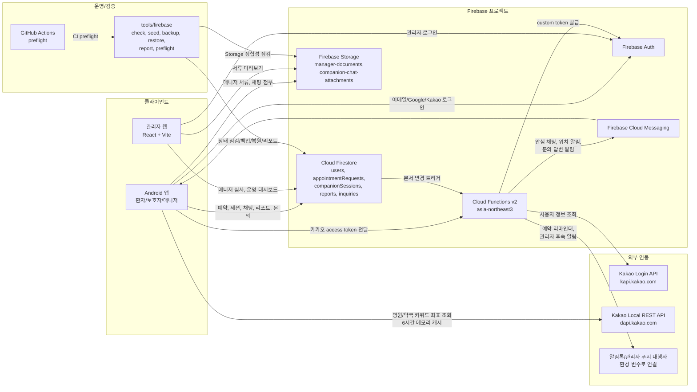

# 시스템 아키텍처 다이어그램

기준일: 2026-06-25

아래 다이어그램은 Android 앱, 관리자 웹, Firebase Auth, Firestore, Storage, Functions, FCM, Kakao API가 현재 어떤 흐름으로 연결되는지 한 장으로 정리한 것이다.

## 흐름 요약

- Android 앱은 Firebase 설정이 있으면 Firebase 구현을 사용하고, 설정이 없으면 Mock Repository로 전환한다.
- 관리자 웹은 Firebase Auth로 로그인한 뒤 `users/{uid}.role == ADMIN`인 계정만 운영 화면에 진입시킨다.
- Firestore Rules와 Storage Rules도 같은 `users/{uid}.role` 문서 값을 기준으로 역할 권한을 판단한다.
- Kakao 로그인은 앱이 Kakao access token을 Functions에 넘기고, Functions가 Kakao 사용자 정보를 확인한 뒤 Firebase custom token을 발급한다.
- 병원/약국 실좌표 검색은 현재 Android 앱이 Kakao Local REST API를 직접 호출하며, 같은 질의는 6시간 메모리 캐시로 중복 호출을 줄인다.
- 문의 답변, 안심 채팅, 위치 도착, 예약 리마인더, 관리자 후속 알림은 Firestore 문서 변경 또는 스케줄러를 통해 Functions가 처리한다.
