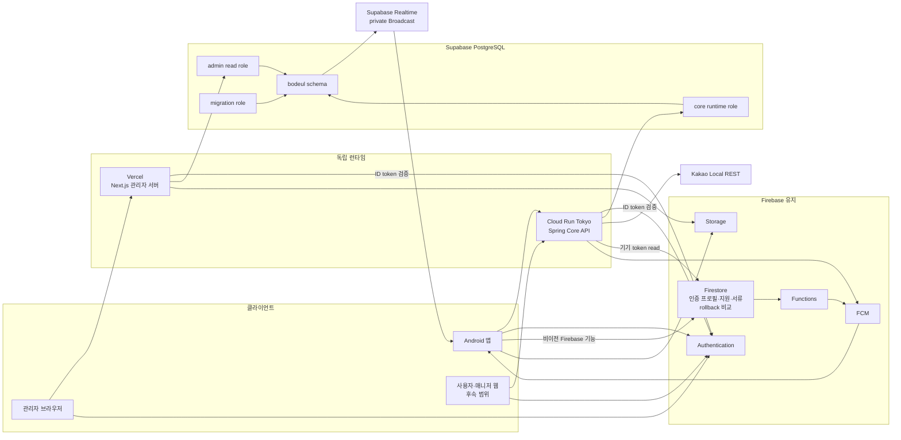

# 시스템 아키텍처 다이어그램

기준일: 2026-07-19

개발 환경에서 실제 검증한 서버·데이터 경계와 production 전환 전 상태를 함께 표시한다.

## 해석

- 관리자 서버와 Core API는 서로를 호출하지 않고 같은 DB에 별도 role로 접근한다.
- DB migration은 메인 저장소의 Spring 모듈만 소유한다.
- Firebase Auth, FCM, Storage와 결합 Functions는 유지한다.
- 개발 업무 원본은 PostgreSQL이며 Firestore 업무 쓰기는 차단했다. Firestore는 인증 프로필·지원·서류와 rollback 비교 자료에만 남는다.
- 채팅·위치는 PostgreSQL에 영속 저장하고 private Broadcast는 변경 신호만 보낸다. 재연결 뒤 Core API snapshot을 다시 읽는다.
- Android의 Kakao 로그인·지도 SDK는 클라이언트에 남지만 Kakao Local REST는 Core API 뒤에 둔다.
- production 프로젝트와 DB schema 분리는 완료했지만 아직 사용자 트래픽을 연결하지 않았다. 이 다이어그램은 검증된 개발 경계와 출시 전 production 목표를 함께 나타낸다.

상세 판단은 [현재 인프라 구성도](infra-overview.md)와 [목표 인프라 구조](target-infrastructure.md)를 따른다.
