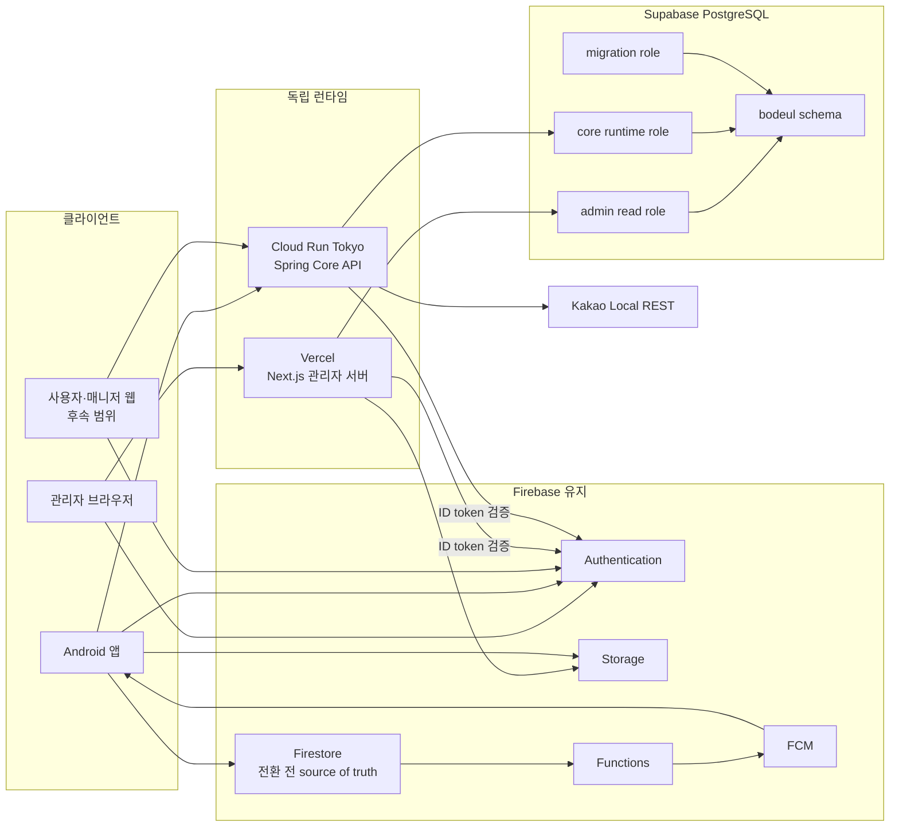

# 시스템 아키텍처 다이어그램

기준일: 2026-07-17

개발 환경에서 실제 검증한 서버 경계와 아직 전환 중인 데이터 경계를 함께 표시한다.

## 해석

- 관리자 서버와 Core API는 서로를 호출하지 않고 같은 DB에 별도 role로 접근한다.
- DB migration은 메인 저장소의 Spring 모듈만 소유한다.
- Firebase Auth, FCM, Storage는 유지한다.
- Firestore는 도메인별 전환이 끝날 때까지 남으며, PostgreSQL read model이 있다고 바로 source of truth가 바뀌는 것은 아니다.
- Android의 Kakao 로그인·지도 SDK는 클라이언트에 남지만 Kakao Local REST는 Core API 뒤에 둔다.
- production 프로젝트 분리는 아직 남아 있으므로 이 다이어그램은 개발 인프라 검증 완료와 운영 전환 목표를 함께 나타낸다.

상세 판단은 [현재 인프라 구성도](infra-overview.md)와 [목표 인프라 구조](target-infrastructure.md)를 따른다.
