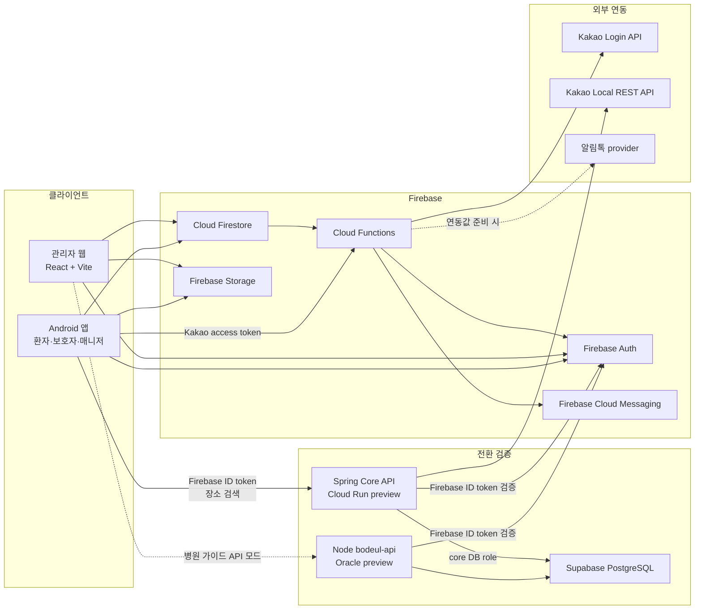
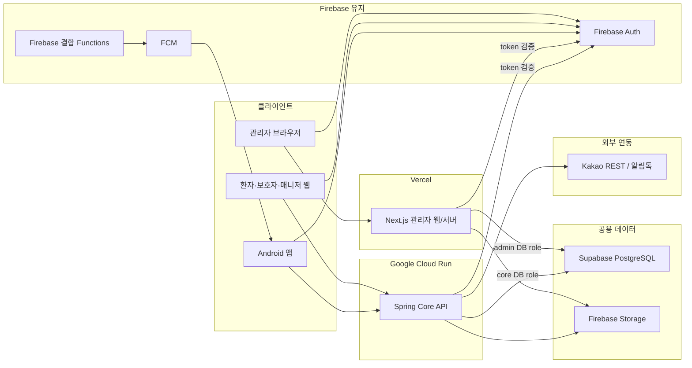

# 시스템 아키텍처 다이어그램

기준일: 2026-07-16

현재 구현과 운영 목표를 구분해서 표시한다. 목표 다이어그램은 배포 완료 상태가 아니다.

## 현재 구현

현재 상태의 핵심:

- 관리자 웹 대부분과 Android 앱은 Firestore를 직접 사용한다.
- Node `bodeul-api`는 병원 가이드 read API와 인증·DB 경계를 검증한 preview 자산이다.
- Spring Core API preview는 Firebase ID token과 PostgreSQL 역할을 검증하고 Kakao Local 장소 검색을 대행한다.
- Android는 Kakao Local REST를 직접 호출하지 않는다. Core API 검색 실패 시 로컬 병원 목록 또는 기본 지도 안내를 사용한다.
- 알림톡 전송 코드는 있으나 배포된 운영 발송 함수는 확인되지 않았다.

## 목표 인프라

목표 상태의 핵심:

- Vercel Next.js 관리자 서버와 Cloud Run Spring Core API는 서로를 경유하지 않는다.
- 두 서버는 같은 PostgreSQL을 사용하되 별도 runtime role과 공용 migration을 사용한다.
- Firebase Auth와 FCM은 유지한다.
- Kakao REST와 알림톡은 Spring Core API 뒤로 옮기고, 클라이언트 SDK가 필요한 로그인과 지도만 Android에 남긴다.
- Android의 WebView 전환은 별도 제품 결정이며 인프라 선행 조건이 아니다.

상세 기준은 [목표 인프라 구조](target-infrastructure.md)와 [Spring Core API 인프라 런북](../operations/core-api-infrastructure-runbook.md)을 따른다.
