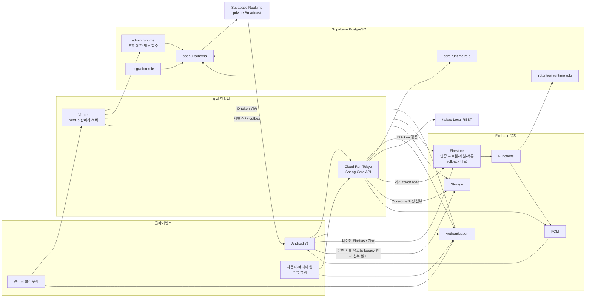

# 시스템 아키텍처 다이어그램

기준일: 2026-09-21

개발 환경에서 실제 검증한 서버·데이터 경계와 production 전환 전 상태를 함께 표시한다.

```mermaid
flowchart LR
  subgraph Client["클라이언트"]
    Admin["관리자 브라우저"]
    Android["Android 앱"]
    UserWeb["사용자·매니저 웹\n후속 범위"]
  end

  subgraph Runtime["독립 런타임"]
    Next["Vercel\nNext.js 관리자 서버"]
    Spring["Cloud Run Tokyo\nSpring Core API"]
  end

  subgraph Firebase["Firebase 유지"]
    Auth["Authentication"]
    Firestore["Firestore\n인증 프로필·지원·서류\nrollback 비교"]
    Storage["Storage"]
    Functions["Functions"]
    FCM["FCM"]
  end

  subgraph Database["Supabase PostgreSQL"]
    Schema["bodeul schema"]
    AdminRole["admin runtime\n조회·제한 업무 함수"]
    CoreRole["core runtime role"]
    Migration["migration role"]
    Retention["retention runtime role"]
  end

  Realtime["Supabase Realtime\nprivate Broadcast"]

  Kakao["Kakao Local REST"]

  Admin --> Next
  Android --> Spring
  UserWeb --> Spring
  Admin --> Auth
  Android --> Auth
  UserWeb --> Auth
  Next -->|"ID token 검증"| Auth
  Spring -->|"ID token 검증"| Auth
  Next --> AdminRole
  Spring --> CoreRole
  AdminRole --> Schema
  CoreRole --> Schema
  Migration --> Schema
  Functions --> Retention
  Retention --> Schema
  Spring --> Kakao
  Schema --> Realtime
  Realtime --> Android
  Android -->|"비이전 Firebase 기능"| Firestore
  Spring -->|"기기 token read"| Firestore
  Next -->|"서류 심사·outbox"| Firestore
  Next --> Storage
  Android -->|"본인 서류 업로드·legacy 환자 첨부 읽기"| Storage
  Spring -->|"Core-only 채팅 첨부"| Storage
  Firestore --> Functions
  Functions --> FCM
  Spring --> FCM
  FCM --> Android
```

## 해석

- 관리자 서버와 Core API는 서로를 호출하지 않고 같은 DB에 별도 role로 접근한다.
- DB migration은 메인 저장소의 Spring 모듈만 소유한다.
- Firebase Auth, FCM, Storage와 결합 Functions는 유지한다. 보존 worker는 retention role의 제한된 DB 함수로 후보·파기를 처리한다.
- 개발 업무 원본은 PostgreSQL이며 Firestore 업무 쓰기는 차단했다. Firestore는 인증 프로필·지원·서류와 rollback 비교 자료에만 남는다.
- 채팅·읽음과 legacy 위치 계약은 PostgreSQL을 사용하고 private Broadcast는 변경 신호만 보낸다. 재연결 뒤 Core API snapshot을 다시 읽는다. legacy 위치는 기본 OFF이며 환자 GPS 1분 공유 목표와 구분한다.
- Core-only 채팅 첨부 원본은 Spring Core API가 Firebase Storage에 저장한다. 참여자와 만료 여부는 PostgreSQL에서 판정하고 Android는 Storage URL을 직접 받지 않는다.
- Android의 Kakao 로그인·지도 SDK는 클라이언트에 남지만 Kakao Local REST는 Core API 뒤에 둔다.
- 이 그림은 코드와 목표의 책임 경계다. 현재 서버 가용성이나 전체 production 개방을 뜻하지 않는다. 관리자 웹 배포·환경 표시와 별개로 production DB 일시정지·접속·업무 검증은 [환경 기준](../operations/admin-web-environments.md)에 남아 있다.

상세 판단은 [현재 인프라 구성도](infra-overview.md)와 [목표 인프라 구조](target-infrastructure.md)를 따른다.
