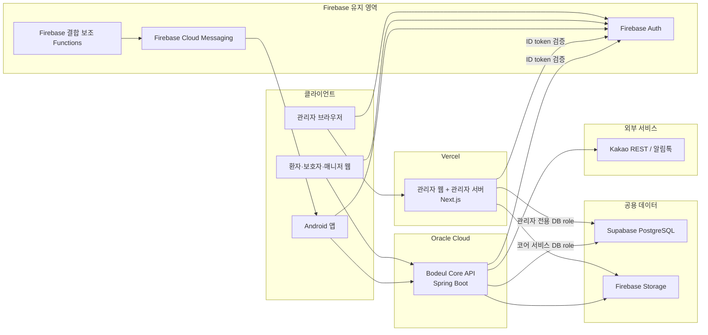

# 목표 인프라 구조

기준일: 2026-07-12

초기에는 빠른 구현을 우선했기 때문에 모든 선택 근거가 사전에 정리되지는 않았다.
현재는 구현된 구조를 기준으로 선택 이유, 대안, 단점, 전환 조건을 정리하고 있다.

## 결정 상태

이 문서는 멘토링에서 합의한 운영 목표를 기록한다. 현재 배포가 이 구조로 전환됐다는 뜻은 아니다.

- 현재 관리자 웹은 React + Vite 정적 앱이다.
- 현재 `api/`는 Node.js + TypeScript로 만든 전환 검증용 API다.
- Oracle, Supabase, Firebase Admin을 연결한 preview 검증은 통과했지만 production 전환은 하지 않았다.
- 목표는 관리자 경로와 사용자 경로가 서로의 서버를 거치지 않고 공용 PostgreSQL에 각각 접근하게 만드는 것이다.

## 목표 구조

## 서버 경계

### 관리자 웹

- 저장소와 배포 단위는 `bodeul-admin-web`으로 유지한다.
- 목표 런타임은 Vercel에 배포하는 Next.js다.
- 관리자 브라우저는 Firebase Auth로 로그인하고 ID token을 관리자 서버에 전달한다.
- Next.js 서버가 Firebase ID token과 PostgreSQL의 관리자 role을 확인한다.
- Next.js 서버가 Supabase PostgreSQL에 직접 연결한다.
- 관리자 서버가 Spring Core API를 다시 호출한 뒤 DB로 가는 연쇄 구조는 만들지 않는다.

여기서 직접 연결은 브라우저의 DB 접속이 아니라 Vercel 서버 코드의 PostgreSQL 접속을 뜻한다. DB 접속 문자열과 privileged key는 `NEXT_PUBLIC_` 환경변수에 넣지 않는다.

### 사용자 서비스

- 환자, 보호자, 매니저 웹과 Android 앱은 Spring Core API를 사용한다.
- Core API는 Java + Spring Boot로 구현하고 OCI에 독립 배포한다.
- 예약, 매칭, 동행 세션, 리포트, 사용자용 조회와 쓰기를 담당한다.
- 외부 REST API와 서버 비밀값이 필요한 연동은 Core API가 소유한다.
- Android를 WebView로 바꾸는 작업은 인프라 전환과 분리한다. 현재 네이티브 앱은 Core API client로 전환한다.

### 공용 DB

- 관리자 서버와 Core API는 같은 Supabase PostgreSQL을 사용한다.
- DDL과 migration은 한 곳에서만 관리한다. 초기 migration 소유자는 메인 저장소의 `core-api/`로 둔다.
- 서버 전용 테이블은 Data API에 노출하지 않는 `bodeul` schema에 둔다.
- 권한 role은 `bodeul_migration`, `bodeul_core_runtime`, `bodeul_admin_runtime`으로 분리한다.
- 접속 role은 `bodeul_migrator`, `bodeul_core_service`, `bodeul_admin_service`로 분리하고 비밀번호는 migration 파일 밖에서 설정한다.
- 관리자 서버와 Core API가 같은 테이블을 임의로 다르게 해석하지 않도록 공용 데이터 계약을 문서화한다.
- Firebase UID는 `app_users.firebase_uid`로 연결하고, 권한은 PostgreSQL role을 최종 기준으로 검증한다.

Supabase Data API를 클라이언트에서 사용하지 않는 테이블은 공개 API 노출 대상에서 제외한다. `public`의 신규 객체 자동 grant는 차단하고, 서버 전용 테이블은 `bodeul` schema에서 명시적 DML grant만 사용한다.

## 연결 방식

| 실행 환경 | PostgreSQL 연결 기준 |
| --- | --- |
| Vercel Next.js | 짧은 수명의 서버리스 연결이므로 Supavisor transaction mode 6543 포트를 사용한다. prepared statement 비활성화 여부를 DB client 기준으로 확인한다. |
| OCI Spring Core API | 장기 실행 서버다. OCI에서 IPv6 direct 연결이 가능하면 direct 5432를 사용하고, IPv4 제약이 있으면 Supavisor session mode 5432를 사용한다. |
| migration, backup, restore | 가능하면 direct connection을 사용하고 런타임 role과 분리한 migration role을 사용한다. |

개발 DB의 `max_connections` 60을 기준으로 Core 5, Admin 5, Migration 2의 상한으로 시작한다. 합계 12개는 전체의 20%이며 Auth, Storage 등 Supabase 관리 서비스의 연결 여유를 남긴다. 연결 문자열은 Vercel과 OCI의 비공개 환경 설정에만 둔다.

## Firebase 유지 범위

| 기능 | 결정 |
| --- | --- |
| Auth | 유지. 관리자 서버와 Core API가 ID token을 검증한다. |
| FCM | 유지. 앱 푸시 전환은 DB 전환과 분리한다. |
| Storage | 유지 후보. 파일 원본은 Storage, 심사 상태와 메타데이터는 PostgreSQL에 둔다. |
| Functions | FCM 트리거, 소셜 로그인 custom token처럼 Firebase에 강하게 결합된 작업만 유지한다. |
| Firestore | 도메인별 전환이 끝날 때까지 기존 source of truth로 유지하고, 전환 완료 후 read-only 또는 종료 여부를 결정한다. |
| Hosting | 관리자 production은 Vercel을 사용한다. Firebase Hosting은 기존 검증 기록과 rollback 범위로만 관리한다. |

## Kakao 경계

- Kakao 로그인과 지도 SDK처럼 클라이언트 SDK가 필요한 기능은 Android에 남긴다.
- Native App Key는 APK에 포함되는 값이므로 Kakao 플랫폼의 패키지명과 키 해시 제한을 적용한다.
- Kakao Local REST, 알림톡, 관리자 키처럼 서버 자격 증명이 필요한 호출은 Spring Core API 뒤로 옮긴다.
- Android와 관리자 웹에 REST API key, 알림톡 provider key, Admin key를 넣지 않는다.
- 기존 Android의 Kakao Local 직접 호출은 Core API proxy가 검증된 화면부터 제거한다.

## 현재 자산의 처리

| 현재 자산 | 처리 방향 |
| --- | --- |
| `api/` Node.js 서버 | PostgreSQL, Firebase token, 관리자 인가 계약을 검증한 프로토타입으로 보존한다. Spring/Next.js가 같은 계약을 충족하면 운영 후보에서 제외한다. |
| React + Vite 관리자 웹 | 기능과 UI를 보존하면서 Next.js로 단계 이전한다. 한 번에 전면 재작성하지 않는다. |
| Android Firebase Repository | 화면별로 Core API Repository를 추가하고 feature flag로 전환한다. |
| Firestore 데이터 | 도메인별 backup, import, row 비교 후 PostgreSQL source of truth로 바꾼다. |
| Oracle preview VM | Spring preview 배포에 재사용할 수 있는지 OS, 포트, systemd, 방화벽 상태를 먼저 점검한다. Node preview와 Spring production을 동시에 운영하지 않는다. |

## 구축 순서

1. 메인 저장소의 `core-api/`에 Java LTS, Spring Boot 기준과 독립 CI를 만든다.
2. Supabase runtime/migration role과 연결 방식을 확정하고 secret 위치를 나눈다.
3. OCI에 Spring preview를 배포하고 HTTPS, systemd, 로그, 헬스체크를 검증한다.
4. Firebase ID token 검증과 PostgreSQL role 인가를 Spring에 이식한다.
5. Kakao Local REST proxy를 Spring에 추가하고 Android 한 화면으로 검증한다.
6. 관리자 웹을 Next.js로 단계 이전하고 관리자 서버가 PostgreSQL에 직접 접근하게 한다.
7. Node `api/`와 기존 Firestore 직접 접근을 도메인별로 종료한다.
8. backup/restore와 rollback 리허설 후 production 환경을 만든다.

## 배포 이름

| 항목 | 이름 |
| --- | --- |
| 관리자 저장소 | `bodeul-admin-web` |
| Core API 소스 경로 | `Bodeul/core-api/` |
| 개발 OCI 서비스 | `bodeul-core-api-preview` |
| 운영 OCI 서비스 | `bodeul-core-api-production` |
| 개발 Supabase 프로젝트 | `bodeul-dev-rdb` |
| 운영 Supabase 프로젝트 | `bodeul-prod-rdb` |
| 개발 GitHub Environment | `core-api-preview` |
| 운영 GitHub Environment | `core-api-production` |
| 개발 migration Environment | `core-api-migration-preview` |
| 운영 migration Environment | `core-api-migration-production` |
| 관리자 preview Environment | `admin-web-preview` |
| 관리자 production Environment | `admin-web-production` |

도메인을 확보하기 전에는 Vercel 기본 도메인과 제한된 preview endpoint만 사용한다. production API는 도메인과 HTTPS가 준비되기 전에는 공개하지 않는다.

## 완료 조건

- 관리자 요청이 Spring 또는 기존 Node API를 거쳐 다시 DB로 가는 중복 경로 없이 Next.js 서버에서 PostgreSQL로 전달된다.
- 사용자 앱과 웹은 Spring Core API만 호출한다.
- Firebase ID token 검증, PostgreSQL role 인가, audit log가 두 서버에서 검증된다.
- 서버 비밀값이 브라우저나 APK에 포함되지 않는다.
- Spring Core API가 OCI에서 HTTPS, systemd, health check, rollback 기준과 함께 동작한다.
- Firestore와 PostgreSQL의 source of truth가 도메인별로 한 곳만 지정된다.
- Node `api/` 종료 조건과 실제 종료 결과가 기록된다.

## 관련 문서

- [PostgreSQL 운영 전환 결정](postgres-operational-transition.md)
- [PostgreSQL 운영 전환 런북](../operations/postgres-operational-transition-runbook.md)
- [Spring Core API 인프라 런북](../operations/core-api-infrastructure-runbook.md)
- [관리자 웹 역할 설명](admin-web-architecture.md)
- [시스템 아키텍처 다이어그램](system-architecture-diagram.md)
