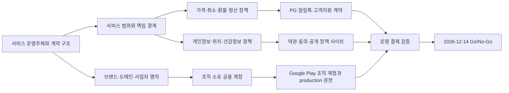

# 기획 정책 및 공용 계정 준비 기준

기준일: 2026-07-19

목표 운영 전환일: 2026-12-15 10:00 KST

문서 상태: 기획 승인 전 기준안

## 문서 목적

이 문서는 구현을 더 진행하기 전에 기획·운영 측이 확정해야 할 제품 정책과 팀 소유 공용 자산을 한 곳에서 관리한다. 현재 코드, 운영 문서, GitHub Issue/Project와 두 저장소의 설정을 대조한 결과를 기준으로 작성했다.

이 문서는 공개 저장소에 둔다. 실제 이메일 주소, 개인 연락처, 결제수단, 사업자번호, D-U-N-S 번호, 계정 ID, 프로젝트 ID, API key와 복구 코드는 기록하지 않는다. 해당 값은 별도 비공개 계정대장과 비밀번호 관리 도구에서 관리한다.

### 상태 표기

| 표기 | 의미 |
| --- | --- |
| 확정 | 현재 설계·운영 문서에서 이미 기준으로 쓰는 값 |
| 권장안 | 현재 규모와 목표 일정에 맞춰 채택을 권장하는 기본값 |
| 기획 결정 | 서비스 책임과 사용자 약속이므로 기획 책임자가 승인해야 하는 값 |
| 외부 검토 | 법무·세무·노무·보험 또는 PG 심사 결과가 필요한 값 |
| 구현 대기 | 정책은 정해졌지만 코드·콘솔 설정·실검증이 남은 값 |

## 한눈에 보는 준비 상태

| 영역 | 현재 상태 | 출시 전 필요한 결정 또는 준비 | 시한 |
| --- | --- | --- | --- |
| 목표 인프라 | 확정 | PostgreSQL 전환과 production 검증을 기존 계획대로 완료 | 2026-12-14 |
| 서비스 운영주체 | 미정 | 계약 당사자, 사업자 형태, 매니저 계약 관계 확정 | 2026-08-15 |
| 서비스 범위 | 미정 | 비의료 동행 범위, 제공 지역·시간, 이용 대상과 긴급상황 경계 확정 | 2026-08-15 |
| 가격·결제·환불 | 화면용 임시값만 존재 | 요금표, 초과시간, 취소·환불, PG와 정산 구조 확정 | 2026-09-15 |
| 매니저 심사 | 업로드 흐름은 존재 | 필수 서류 최소화, 심사·재심사·이의제기 기준 확정 | 2026-09-15 |
| 개인정보·위치 | 기술 보관값은 존재 | 처리방침, 별도 동의, 위치 약관·신고 대상 검토와 책임자 승인 | 2026-10-16 |
| 브랜드·도메인 | 도메인 없음 | 기준 도메인, 개발자 표시명, Android package name 확정 | 2026-08-15 |
| 공용 계정 소유권 | 개인 소유가 섞여 있음 | 팀/조직 소유로 이전하고 실명 관리자 2명 지정 | 2026-10-16 |
| Google Play | 미준비 | 조직 계정, D-U-N-S, release signing, 스토어 선언 준비 | 2026-11-16 |
| 공개 정책 사이트 | 없음 | 개인정보·약관·위치·탈퇴·고객지원 URL 게시 | 2026-11-16 |
| 운영 유료 등급 | 개발 등급 사용 중 | Supabase Pro, Vercel Pro와 결제·비밀값 관리 준비 | 2026-11-16 |
| 출시 검증 | 일부 준비 | App Check, rollback, 계정 삭제, 역할별 E2E와 Go/No-Go 통과 | 2026-12-14 |

## 결정 순서

서비스 운영주체가 정해지기 전에는 PG, 알림톡, Google Play 조직 계정과 사업자 명의 계약을 확정하지 않는다. 도메인과 package name은 외부에 노출되고 변경 비용이 크므로 계정 생성보다 먼저 확정한다.

## 재논의하지 않는 기술 기준

다음은 기획 선택지가 아니라 이미 정한 목표 구조다.

- 환자·보호자·매니저 Android/향후 사용자 웹은 Spring Core API를 거쳐 업무 데이터에 접근한다.
- 관리자 웹은 별도 저장소의 Next.js 관리자 서버를 거쳐 같은 PostgreSQL에 접근한다.
- Core API와 관리자 서버는 서로를 proxy로 호출하지 않고 서로 다른 최소 권한 DB role을 쓴다.
- Supabase PostgreSQL이 사용자, 예약, 매칭, 동행, 채팅, 위치, 리포트와 운영 메타데이터의 단일 원본이 된다.
- Firebase는 Auth, FCM, App Check, Storage와 Firebase 결합 Functions에 한정한다.
- 파일 원본은 DB에 넣지 않고 Firebase Storage에 두며, PostgreSQL에는 소유권·상태·해시·만료 정보만 둔다.
- Kakao Local REST API key는 APK에 넣지 않고 Core API가 보유한다.
- 관리자 웹은 Vercel, Core API는 Google Cloud Run Tokyo에 배포한다.
- 개발과 production의 Firebase/GCP 및 Supabase 프로젝트를 분리한다.

상세 구조는 [인프라 개요](../architecture/infrastructure.md)와 [2026년 Production 운영 전환 계획](../operations/production-transition-plan-2026.md)을 따른다.

## 기획 승인 보드

### P0: 2026-08-15까지 정할 항목

| ID | 결정할 정책 | 권장 기본값 | 기획이 확정할 결과 |
| --- | --- | --- | --- |
| POL-01 | 서비스 운영주체 | 보들이 이용자와 계약하는 비의료 병원 동행 서비스 사업자, 매니저는 별도 계약한 서비스 제공자 | 법적 상호, 사업자 형태, 계약 당사자, 책임자 |
| POL-02 | 서비스 성격 | 진단·처방·의료행위가 아닌 이동·접수·대기·기록 전달 보조 | 제공하는 일과 금지하는 일의 목록 |
| POL-03 | 이용 대상 | 성인 환자와 적법한 권한을 가진 보호자를 기본 대상으로 시작 | 미성년자, 의사결정 곤란 환자, 대리 예약 허용 조건 |
| POL-04 | 지역·운영시간 | 초기 1개 권역, 예약제, 운영시간 내 제공 | 정확한 지역, 요일·시간, 최소 예약 리드타임 |
| POL-05 | 매니저 관계 | 독립된 서비스 제공 계약을 기본안으로 검토 | 근로자성, 보수 지급, 세금, 보험, 교육 책임에 대한 외부 검토 결과 |
| POL-06 | 사고 책임 | 119·병원·보호자 연락을 우선하고 앱 SOS는 연락 보조 수단 | 응급상황 절차, 배상 책임, 보험 가입 범위 |
| POL-07 | 브랜드 식별자 | 브랜드 `보들`, 영문 `BoDeul`, 기준 도메인 후보 `bodeul.app` | 실제 구매 도메인, 법적 운영자명, 대외 표시명 |
| POL-08 | Android 식별자 | `com.example.bodeul`을 폐기하고 `app.bodeul`을 후보로 사용 | 도메인 소유와 Play 등록 가능성을 확인한 최종 package name |
| POL-09 | 로그인 제공자 | 출시 시 이메일·Google·Kakao, Naver는 서버 연동과 약관 준비 후 추가 | 필수 로그인 수단, 계정 연결·중복 처리 기준 |

POL-01과 POL-05는 법률·노무·세무 결론을 대신하지 않는다. 현재 규모에서 구현 가능한 권장 구조이며, 실제 계약서와 정산 방식은 전문가 검토 후 확정한다.

### P0: 2026-09-15까지 정할 항목

| ID | 결정할 정책 | 권장 기본값 | 기획이 확정할 결과 |
| --- | --- | --- | --- |
| POL-10 | 기본 요금 | 기본 시간과 포함 업무를 먼저 정한 뒤 단일 기본요금으로 시작 | 금액, 포함 시간, VAT 표시, 지역별 차등 여부 |
| POL-11 | 추가 요금 | 보조기구, 왕복, 초과시간처럼 측정 가능한 항목만 허용 | 항목별 금액, 계산 단위, 사전 고지와 승인 시점 |
| POL-12 | 쿠폰 | 출시 이벤트용 고정 할인만 제한적으로 운영 | 발급 주체, 중복 여부, 유효기간, 환불 시 복원 규칙 |
| POL-13 | 취소·환불 | 서비스 시작 전 시간대별 환불률, 매니저·운영자 취소는 전액 환불 | 구간, 노쇼, 지각, 일정 변경, 부분 수행 기준 |
| POL-14 | 결제 시점 | 예약 시 승인 또는 결제하고 변경 금액은 이용자 재승인 후 처리 | 승인·매입 시점, 실패·중복 결제, 영수증 발급 |
| POL-15 | 정산 | 고객 결제와 매니저 지급을 별도 원장으로 관리 | 플랫폼 수수료, 지급 주기, 원천징수·세금계산, 보류·차감 기준 |
| POL-16 | 분쟁·차지백 | 관련 세션 자료를 최소 권한 legal hold로 분리 | 접수기한, 담당자, 증빙 범위, 최종 결정·이의제기 절차 |
| POL-17 | 매니저 심사 | 신원·필수 자격·정산정보 중 목적에 꼭 필요한 것만 수집 | 필수/선택 서류, 승인·반려 사유, 재심사 주기 |
| POL-18 | 서류 최소화 | 주민등록등본·범죄경력·건강정보를 기본 필수로 두지 않음 | 각 서류의 법적 근거, 마스킹 방식, 열람자, 원본 파기 시점 |
| POL-19 | 서비스 상태 | 신청-매칭-진행-완료-취소를 기준으로 예외 상태를 추가 | 상태 전이, 수정 가능 시점, 대체 매니저 기준 |
| POL-20 | 고객지원 | 앱 문의와 운영 이메일을 기본으로 하고 긴급상황과 일반 문의를 분리 | 운영시간, 최초 응답 목표, 야간·휴일 대응 |

현재 코드의 `69,000원`, 보행 보조 `8,000원`, 휠체어 `15,000원`, 왕복 `22,000원`, 쿠폰 `5,000원/10,000원`은 화면 검증용 임시 상수다. 기획 승인 전에는 가격표, 약관, PG 상품값이나 정산 근거로 사용하지 않는다.

보들은 사람의 현장 동행이라는 물리적 서비스를 판매하므로 Google Play Billing 대상 디지털 상품으로 설계하지 않는다. 실제 결제는 국내 PG 계약과 서버 검증을 사용한다. PG 선택 전 POL-01, POL-10~16과 사업자 명의가 먼저 확정되어야 한다.

### P0: 2026-10-16까지 정할 항목

| ID | 결정할 정책 | 권장 기본값 | 기획이 확정할 결과 |
| --- | --- | --- | --- |
| POL-21 | 개인정보 역할 | 운영주체를 개인정보처리자로 두고 개인정보 보호책임자·실무 담당자를 지정 | 책임자, 문의 경로, 처리위탁·제3자 제공 목록 |
| POL-22 | 환자·보호자 권한 | 환자 본인 동의 또는 적법한 대리 권한이 확인된 보호자만 연결 | 연결·해제, 열람 범위, 사망·의사결정 곤란 등 예외 절차 |
| POL-23 | 건강정보 | 건강 프로필·복약·진료 메모는 별도 동의와 최소 수집 적용 | 필수/선택 필드, 이용 목적, 제공 대상, 동의 철회 영향 |
| POL-24 | 위치정보 | 동행 중 안전·진행 공유에만 사용하고 장기 분석·마케팅에 쓰지 않음 | 수집 시작·종료, 보호자/관리자 공개 범위, 신고·약관 검토 결과 |
| POL-25 | 채팅·첨부 | 세션 참여자와 승인된 운영자만 접근, 원문을 분석·광고에 재사용하지 않음 | 금지 콘텐츠, 신고·차단, 운영자 열람 조건 |
| POL-26 | 보관·파기 | 기존 기술 기본값을 채택하되 법정 보존 자료만 별도 분리 | 법무 검토 결과, 파기 책임자, legal hold 승인자 |
| POL-27 | 탈퇴·삭제 | 앱 내 탈퇴와 외부 웹 삭제 요청 경로를 모두 제공 | 본인 확인, 즉시 삭제/법정 보관 분리, 처리기한 |
| POL-28 | 약관 체계 | 서비스 이용약관, 개인정보 처리방침, 위치 약관, 건강정보 별도 동의 분리 | 문서 책임자, 버전, 시행일, 재동의 조건 |
| POL-29 | 알림·마케팅 | 예약·안전·결제 등 정보성 알림과 마케팅 동의를 분리 | 채널별 발송 기준, 야간 발송, 수신 거부, 실패 fallback |
| POL-30 | 리포트·후기 | 매니저 기록은 의료 진단이 아니며 사실 정정·이의제기 경로 제공 | 열람자, 수정 가능 기간, 후기 공개·신고 기준 |

건강정보·위치정보·매니저 증빙은 민감도가 높다. 구현 편의를 이유로 수집 항목을 늘리지 않고, 실제 출시 전 개인정보 보호책임자 또는 국내 법률 전문가가 약관·동의·보관 기간과 콘솔 선언을 함께 대조한다.

### P1: 운영 전 확정할 항목

| ID | 항목 | 권장안 | 전환 조건 |
| --- | --- | --- | --- |
| POL-31 | 카카오 알림톡 | 예약 확정·변경·취소·결제 같은 정보성 템플릿만 사용 | 월 발송량, 공식 딜러 견적, 채널·템플릿 심사 완료 |
| POL-32 | AI 음성 | MVP에서 제외 | 녹음 동의, 전사 제공자, 국외 이전, 원본 파기와 오류 책임 확정 |
| POL-33 | OCR | MVP에서 제외 | 대상 문서, 정확도 임계값, 사람 확인, 민감정보 처리 기준 확정 |
| POL-34 | Naver 로그인 | 출시 필수에서 제외 | 서버 proxy, client secret, 계정 연결과 탈퇴 계약 완료 |
| POL-35 | 사용자 웹 | Android 운영 안정화 뒤 같은 Core API로 제공 | 대상 사용자와 접근성 요구, 별도 출시 일정 확정 |

## 데이터 보관 권장값

아래 값은 이미 구현에 반영한 기술 기본값이다. 기획은 사용자 고지 문구와 법정 보존 예외만 확정한다.

| 데이터 | 권장 기간 | 운영 원칙 |
| --- | --- | --- |
| 진행 중 정밀 위치 | 세션 중, 종료·취소 후 24시간 이내 삭제 | 장기 통계·평가에 재사용하지 않음 |
| 위치 수집·이용·제공 감사자료 | 좌표 없이 6개월 | 주체·목적·시각·제공 대상만 보관 |
| 채팅 본문 | 종료·취소 후 180일 | CS·분쟁 확인 외 사용 금지 |
| 채팅 첨부 | 종료·취소 후 30일 | 원본 삭제 후 메타데이터 상태 갱신 |
| 매니저 증빙 원본 | 심사 완료 후 30일 | 심사 결과와 유효기간만 별도 유지 |
| 매니저 심사 메타데이터 | 자격 유지 기간 + 1년 | 최소 감사 필드만 유지 |
| 반려·철회 신청 원본 | 결정·철회 후 30일 | 최소 감사 이벤트는 1년 |
| 운영 로그 | 30일 | token, 좌표, 본문, 파일 경로 기록 금지 |
| Supabase 제공자 백업 | 7일 | production Pro 기준 |
| 외부 logical dump | 최근 4주 | 암호화, 제한된 저장소, 순환 삭제 |
| legal hold | 기본 최대 180일 | 근거·승인자·종료일 기록, 장기 보관은 별도 법적 근거 필요 |

상세 실행 기준은 [데이터 보관 및 파기 정책](../operations/data-retention-policy.md)을 따른다.

## 브랜드와 공개 주소 권장안

| 용도 | 권장 명칭 또는 주소 | 상태 |
| --- | --- | --- |
| 한국어 브랜드 | `보들` | 권장안 |
| 영문 브랜드 | `BoDeul` | 권장안 |
| 기준 도메인 | `bodeul.app` | 구매 가능 여부와 상표 확인 필요 |
| 공개 서비스·정책 | `https://bodeul.app` | 도메인 확정 후 생성 |
| 관리자 웹 | `https://admin.bodeul.app` | 기존 Vercel 프로젝트에 연결 |
| Core API | `https://api.bodeul.app` | Cloud Run custom domain 또는 앞단 mapping |
| 향후 사용자 웹 | `https://app.bodeul.app` | 예약만 하고 지금 배포하지 않음 |
| 개인정보 처리방침 | `https://bodeul.app/privacy` | 공개 HTML 필요 |
| 서비스 이용약관 | `https://bodeul.app/terms` | 공개 HTML 필요 |
| 위치기반서비스 약관 | `https://bodeul.app/location-terms` | 적용 여부 외부 검토 필요 |
| 계정 삭제 요청 | `https://bodeul.app/delete-account` | 실제 요청 가능한 경로 필요 |
| 고객지원 | `https://bodeul.app/support` | 운영시간과 연락 경로 표시 |
| Android package | `app.bodeul` | Play 등록 전 최종 확인 필요 |
| Google Play 개발자 표시명 | `보들` | 법적 운영주체와 함께 검증 |
| GitHub organization slug | `bodeul-team` | 2026-07-19 조회 시 후보, 생성 시 재확인 |

`com.example.bodeul`은 개발용 placeholder이므로 외부 테스트 트랙을 만들기 전에 바꾼다. Play에 한 번 배포한 package name은 변경 비용이 매우 크므로 도메인과 운영주체 확정 뒤 조직 Play 계정에서 앱을 먼저 생성하고 코드·Firebase·Kakao 설정을 같은 값으로 맞춘다.

공개 정책 사이트는 관리자 웹과 인증 경계를 섞지 않는 별도 `bodeul-public-site` 저장소·Vercel 프로젝트를 권장한다. 같은 Vercel 팀에서 운영하면 새 개발자 좌석 없이 배포할 수 있다. 정책 문서가 승인되기 전에는 저장소와 프로젝트만 먼저 만들지 않는다.

## 공용 계정과 결제 준비표

### 운영주체가 먼저 준비할 비공개 자료

아래 자료가 없으면 플랫폼 계정을 만들 수는 있어도 다시 개인 명의에서 이전해야 한다. 운영주체를 확정한 뒤 원본은 접근 제한 저장소에 보관하고, 플랫폼에는 요구되는 최소 범위만 제출한다.

| 자료 | 사용처 | 준비 기준 |
| --- | --- | --- |
| 사업자등록·법인 증빙 | Play, Kakao Biz, PG, 결제·세금 | 실제 계약 당사자와 모든 콘솔 법적 명칭을 일치시킴 |
| 대표자·권한 위임 증빙 | 조직 계정 본인 확인, PG 심사 | 담당자가 대표자가 아니면 유효한 위임 범위 기록 |
| 사업장 주소·대표 전화 | Play 공개 정보, PG, 약관 | 실제 연락 가능하고 변경 시 갱신 책임자 지정 |
| 사업용 정산계좌 | PG 정산, 매니저 지급 | 고객 결제 정산과 매니저 지급 원장을 구분 |
| 사업용 결제카드 | 클라우드·SaaS 구독 | 개인 생활비 카드와 분리하고 월 한도·대체 카드 지정 |
| D-U-N-S 번호 | Google Play Organization 검증 | 무료 발급을 먼저 신청하고 법적 명칭·주소 일치 확인 |
| 도메인 소유 증빙 | Cloud Identity, Play 웹사이트, Kakao | 운영주체 명의와 갱신 책임자를 비공개 대장에 기록 |
| 개인정보 보호책임자 지정 | 처리방침, 삭제·열람 요청 | 이름·연락 경로·대체 담당자와 승인 권한 확정 |
| 보험·사고 대응 자료 | 서비스 사고, 배상, 매니저 계약 | 필요한 보험 종류와 보상 범위를 전문가와 검토 |
| 표준 계약·약관 원본 | 이용자, 매니저, 위탁사, PG | 버전·시행일·승인자와 재동의 조건을 기록 |

통신판매업 신고, 세금 처리, 매니저 근로자성·원천징수와 보험 의무는 서비스 운영주체와 계약 구조에 따라 달라질 수 있다. 개발팀이 임의로 결론 내리지 않고 POL-01·05 승인 과정에서 법무·세무·노무 검토 대상으로 묶는다.

### 소유권 원칙

- 공용 로그인 한 개를 여러 사람이 공유하지 않는다.
- 모든 서비스는 법적 운영주체 또는 팀 조직이 소유하고, 실명 사용자 계정에 역할을 부여한다.
- production 변경·결제·복구가 가능한 실명 관리자 2명을 지정한다.
- 결제수단은 운영주체 명의 카드 또는 승인된 사업용 카드로 통일한다.
- MFA를 강제하고 복구 코드와 비상 절차는 암호화한 팀 vault와 오프라인 봉인본으로 분리한다.
- 서비스 계정 JSON key를 만들지 않고 가능한 곳은 GitHub OIDC/WIF를 사용한다.
- 퇴사·역할 변경 시 당일 권한 회수, 분기 1회 접근 권한 검토를 실시한다.

### 서비스별 준비 수준

| 서비스 | 권장 소유 단위·표시명 | 권장 등급 | 예상 결제 | 준비 시점 | 현재 판단 |
| --- | --- | --- | ---: | --- | --- |
| 법적 운영주체 | 확정한 사업자/법인 명의 | 해당 없음 | 등록·법무·세무 실비 | 가장 먼저 | 미정, 외부 검토 필요 |
| 기준 도메인 | 운영주체 명의, `bodeul.app` 후보 | 등록기관 기본 + Cloudflare Free DNS | 연 50,000 KRW 이내 목표 | 2026-08~10 | 미구매 |
| Cloudflare | `BoDeul` account | Free | 0 | 도메인 구매 직후 | 개인 소유에서 조직 운영으로 정리 필요 |
| Cloud Identity | `BoDeul` organization | Free, 실명 관리자 2명 | 0 | 도메인 연결 직후 | GCP 리소스에 조직 상위 경계 없음 |
| Google Workspace | `BoDeul` | 초기 미구매, 필요 시 Business Starter 2석 | 지역별 checkout 가격 | 공용 발신 mailbox 필요 시 | Cloud Identity + 전달 주소로 시작 가능 |
| GitHub | `bodeul-team` organization | Free | 0 | 2026-10-16까지 | 두 저장소와 Project가 개인 계정 소유 |
| GitHub Team | 같은 organization | 조건부, contributor 수만큼 | USD 4/사용자·월 | 저장소 비공개 전환 시 | 공개 저장소 유지 중에는 미구매 권장 |
| Google Cloud/Firebase | `BoDeul` 조직 아래 dev/prod | Blaze, 사용량 과금 | 정상 목표 10,000 KRW/월, production 알림 30,000 KRW | 이미 사용, 조직 이전 필요 | 프로젝트 분리는 완료 |
| Supabase | `BoDeul` organization | Pro + Micro 2개 | USD 35/월 예상 | 2026-11-16까지 | dev/prod 존재, 현재 조직 소유권 정리 필요 |
| Vercel | `bodeul` team | Pro, Developer 2석 | USD 40/월 + 초과 사용량 | 2026-11-16까지 | 관리자 프로젝트는 개인 team 소속 |
| Bitwarden | `BoDeul` organization | Teams, 최소 운영자 2석 | USD 8/월, 연간 결제 기준 | production secret 입력 전 | 새로 준비 권장 |
| Google Play Console | 운영주체 명의 | Organization, full distribution | USD 25 1회 | D-U-N-S 준비 즉시 | 미준비 |
| Kakao Developers | `보들` Biz app + test app | 기본 무료 | API 초과 사용 시 종량 | 사업자·도메인 확정 후 | dev 설정은 있으나 production 소유권 정리 필요 |
| Kakao Business/알림톡 | `보들` 채널·사업자 명의 | 공식 딜러 계약 | 발송량 기반 견적 | POL-29·31 승인 후 | 계약 전 |
| PG/PortOne | 운영주체 명의 상점 | PG 계약 + PortOne 연동 | 수수료·보증보험·정산주기 견적 | POL-10~16 승인 후 | 계약 전 |
| Figma | `BoDeul Design` team | Starter | 0 | 현재 유지 | Professional Full seat USD 16/월은 필요 시만 |

Cloudflare Email Routing은 수신 메일을 기존 실명 mailbox로 전달하는 용도다. 공용 mailbox, 발신 SMTP 또는 장기 보관 시스템이 아니므로 고객지원에서 `support@...` 명의 발신이 필요해지면 Google Workspace 또는 별도 트랜잭션 메일 서비스를 승인한다.

Kakao Local의 기본 무료 쿼터는 출시 초기 규모에 충분할 가능성이 높지만 호출량을 Core API에서 계측한다. 알림톡은 Kakao Developers API와 별개로 공식 딜러 계약과 템플릿 심사가 필요하므로 무료 API라고 가정하지 않는다.

PG 연동은 포트원이 자금을 보관하거나 지급하는 구조가 아니다. PG사와의 계약, MID 발급, 결제 취소·대사·정산 계좌 준비가 별도로 필요하다. 매니저 지급은 고객 결제 정산과 별도 정책·원장으로 관리한다.

### 공용 역할 주소

도메인 구매 후 아래 주소를 만들되, 모두 전달 주소 또는 그룹으로 사용하고 공유 로그인으로 만들지 않는다.

| 주소 | 용도 | 기본 수신자 |
| --- | --- | --- |
| `ops@bodeul.app` | 배포·장애·서비스 운영 | 운영자 2명 |
| `billing@bodeul.app` | 청구서·비용 알림·PG 정산 | 결제 책임자 + 대체 승인자 |
| `security@bodeul.app` | 보안 경고·취약점·계정 복구 | 보안 담당 + 운영 책임자 |
| `privacy@bodeul.app` | 개인정보·열람·삭제 요청 | 개인정보 보호책임자 + 실무 담당 |
| `support@bodeul.app` | 일반 고객 문의 | 고객지원 담당 |
| `play@bodeul.app` | Play Console과 스토어 연락처 | 출시 담당 + 운영 책임자 |
| `legal@bodeul.app` | 약관·계약·법적 요청 | 운영주체 책임자 |
| `noreply@bodeul.app` | 시스템 발신 전용 | 수신하지 않거나 반송 모니터링 |

### 실명 관리자 역할

| 역할 | 최소 인원 | 권한 |
| --- | ---: | --- |
| 자산 소유 관리자 | 2 | 도메인, Cloud Identity, GitHub, GCP/Firebase, Supabase, Vercel의 소유권 복구 |
| production 배포 승인자 | 2 | Cloud Run·Vercel production과 DB migration 승인, 자기 승인 금지 |
| 결제 관리자 | 2 | 구독 변경, 예산 알림, PG·정산 대사 |
| 개인정보 책임자/실무자 | 각 1 이상 | 처리방침 승인, 삭제·열람 요청, legal hold 승인 |
| 앱 출시 관리자 | 2 | Play Console, release signing, 스토어 선언과 배포 |

한 사람이 여러 역할을 맡을 수 있지만 각 핵심 작업에는 대체 가능한 두 번째 실명 계정이 있어야 한다.

## 월 비용 기준

기존 월 반복 비용 승인 한도 **150,000 KRW**를 유지한다. 계산 편의를 위해 USD 1당 1,500 KRW를 적용하며, 이는 환율 시세가 아니라 환율·해외결제 변동을 흡수하기 위한 계획값이다.

| 필수 반복비 | USD | 계획 환산액 |
| --- | ---: | ---: |
| Supabase Pro + Micro 2개 | 35 | 52,500 KRW |
| Vercel Pro Developer 2석 | 40 | 60,000 KRW |
| Bitwarden Teams 운영자 2석 | 8 | 12,000 KRW |
| 소계 | 83 | 124,500 KRW |
| 도메인 월 환산 상한 | - | 약 4,200 KRW |
| Google Cloud/Firebase 정상 목표 | - | 0~10,000 KRW |
| 정상 총액 | - | 약 128,700~138,700 KRW |

150,000 KRW 한도는 여유가 크지 않다. 해외 결제 세금이나 실제 환율로 예상 총액이 140,000 KRW를 넘으면 추가 유료 서비스 도입을 멈추고 기획·결제 책임자가 다시 승인한다. GCP production의 30,000 KRW는 지출 한도가 아니라 알림 기준이므로 해당 수준까지 사용하면 월 총액이 승인 한도를 넘을 수 있다.

다음 항목은 월 고정 인프라비와 분리해 승인한다.

- PG 수수료, 보증보험, 환불·송금 수수료와 매니저 지급액
- 알림톡·문자 발송 건당 비용
- 법무·세무·노무·보험 검토 비용
- Google Workspace, Figma Professional, GitHub Team 같은 선택 구독
- 트래픽 증가에 따른 Cloud Run, Storage, Firebase와 Supabase 초과 사용량

### 일회성·연간 비용

| 항목 | 권장 예산 | 비고 |
| --- | ---: | --- |
| Google Play 조직 계정 | USD 25 1회 | 영수증과 transaction ID를 비공개 대장에 보관 |
| 기준 도메인 | 연 50,000 KRW 이내 | 갱신 자동결제와 만료 알림을 두 관리자에게 설정 |
| D-U-N-S | 무료 신청 기준 | 최대 30일을 예상하고 조기 신청 |
| FIDO2 보안키 | 운영자별 2개 권장 | 기본키와 분리 보관한 예비키 |
| 법무·세무·노무·보험 | 견적 | 서비스 계약과 매니저 관계 확정에 필요 |

## 공용 계정 생성·이전 순서

### 1단계: 2026-08-15까지

1. POL-01~09를 승인한다.
2. 운영주체의 법적 명칭, 주소, 대표 연락처와 결제 책임자를 확정한다.
3. `bodeul.app` 후보의 상표·도메인·package name 충돌을 확인하고 최종 식별자를 동결한다.
4. 실제 계정값을 기록할 비공개 대장과 비상 복구 절차를 만든다.

### 2단계: 2026-09-15까지

1. POL-10~20을 승인하고 가격표·환불표·매니저 심사표를 만든다.
2. PG 2곳 이상에 같은 거래 구조로 견적을 요청한다.
3. 사업자 계좌·카드, 세금·정산 처리와 필요한 보험을 준비한다.
4. 수집할 매니저 서류를 최소화하고 각 항목의 근거와 마스킹 예시를 만든다.

### 3단계: 2026-10-16까지

1. 도메인을 운영주체 명의로 구매하고 Cloudflare에 연결한다.
2. Cloud Identity Free 조직과 실명 관리자 2명을 만든다.
3. GitHub Free organization `bodeul-team`을 만들고 두 저장소를 이전한다.
4. 사용자 소유 GitHub Project는 조직 Project로 복제·이관하고 Issue 연결을 재검증한다.
5. GCP/Firebase, Supabase, Vercel, Cloudflare와 Figma를 조직·팀 소유로 전환한다.
6. GitHub production Environment에서 자기 승인 금지와 두 번째 승인자를 적용한다.

### 4단계: 2026-11-16까지

1. Supabase Pro, Vercel Pro 2석, Bitwarden Teams 2석을 운영 결제수단으로 전환한다.
2. Google Play Organization 계정, D-U-N-S, 공개 웹사이트와 연락처 검증을 끝낸다.
3. Kakao Biz app·test app, Business Channel과 production 키 소유권을 정리한다.
4. 승인한 PG와 PortOne 상점을 만들고 개발·production MID/secret을 분리한다.
5. 공개 정책 사이트에 개인정보·약관·위치·탈퇴·고객지원 경로를 게시한다.

### 5단계: 2026-12-14까지

1. Play Data safety, Health apps, 계정 삭제와 위치·권한 선언을 실제 앱 동작과 대조한다.
2. release signing key의 기본·예비 보관과 Play App Signing을 검증한다.
3. App Check, production Auth/Kakao/PG, 환불, 탈퇴·파기와 역할별 E2E를 검증한다.
4. 두 운영자가 배포·rollback·계정 복구·비용 알림 절차를 각각 재현한다.
5. 미충족 항목이 있으면 2026-12-15 전환을 연기한다.

## 지금 구매하지 않는 항목

| 항목 | 보류 이유 | 재검토 조건 |
| --- | --- | --- |
| Supabase Team·PITR·custom domain | 현재 데이터 규모와 RTO에 비해 고정비가 큼 | DB 4GB 초과 또는 허용 RPO 24시간 미만 |
| Vercel Enterprise | 현재 두 개발자·단일 관리자 웹 규모에 과함 | SSO·SLA·규제 계약이 필수가 될 때 |
| GitHub Team | 저장소가 공개이고 Free 조직으로 현재 보호 규칙 운영 가능 | 저장소 비공개 전환 또는 Team 전용 통제가 필요할 때 |
| Google Workspace | Cloud Identity와 수신 전달로 초기 운영 가능 | 공용 발신 mailbox·보존·감사가 필요할 때 |
| Figma Professional | 현재 파일 열람·기본 협업은 Starter로 가능 | 팀 library와 고급 handoff가 병목일 때 |
| Cloudflare 유료 compute | DNS·Email Routing만 사용 | public site나 edge 기능의 측정된 요구가 생길 때 |
| Firebase Hosting | 관리자 웹은 Vercel로 확정 | 현재 구조를 바꿀 별도 근거가 생길 때 |
| Oracle Cloud | Core API는 Cloud Run으로 확정 | 지속 부하로 Cloud Run이 비용·성능 목표를 못 맞출 때 |
| AI 음성·OCR 공급자 | 정책·동의·정확도 책임이 미정 | POL-32·33 승인 후 |
| Naver production 로그인 | server secret과 계정 연결 정책 미완료 | POL-34 승인 후 |

## Google Play 출시 준비

보들은 건강 프로필, 복약 정보와 동행 리포트를 다루므로 Play Console은 개인 계정이 아니라 **Organization 계정**을 권장한다. 조직 계정 생성에는 D-U-N-S와 조직 검증 자료가 필요하며 신청 처리 시간을 고려해 2026-09월 안에 준비를 시작한다.

출시 전 다음 산출물이 모두 있어야 한다.

- 최종 package name과 release signing key
- 운영주체 표시명, 공개 주소, 개발자 이메일·전화번호
- 앱 내와 웹의 개인정보 처리방침
- 앱 내 탈퇴 경로와 공개 계정 삭제 요청 URL
- Data safety 선언과 SDK별 수집·공유 목록
- Health apps 선언과 비의료 서비스 설명·면책 문구
- 위치 권한 사용 목적, 동행 중 foreground 사용과 동의 화면
- 테스트 계정, 역할별 심사 가이드와 스토어 검토용 설명
- 앱 아이콘, feature graphic, 역할별 실제 화면 스크린샷
- 고객지원과 이의제기 경로

현재 Manifest에는 정밀·대략 위치와 foreground service location, 알림 권한이 있고 background location 권한은 없다. 실제 기능도 동행 중 foreground 위치로 유지하고, 기획 결정 없이 background location을 추가하지 않는다.

## GitHub 추적 현황

2026-07-19 이 문서 작업을 시작한 시점에는 메인 저장소에 열린 PR이 없었고, 관리자 웹에는 Dependabot PR 1개가 있었다. 다음 열린 Issue가 이 문서의 결정과 직접 연결된다.

| Issue | Project 상태 | 이 문서에서 필요한 선행 결정 |
| --- | --- | --- |
| [#27 결제/정산 실운영 연동 범위](https://github.com/bodeul110/Bodeul/issues/27) | Ready | POL-01, POL-10~16 |
| [#30 AI 음성 리포트](https://github.com/bodeul110/Bodeul/issues/30) | Blocked | POL-32, MVP 이후로 유지 |
| [#31 OCR 처방전/복약 비교](https://github.com/bodeul110/Bodeul/issues/31) | Ready | POL-33, MVP 이후로 유지 |
| [#33 카카오 알림톡](https://github.com/bodeul110/Bodeul/issues/33) | Ready | POL-29·31, 사업자·채널·딜러 견적 |
| [#66 Kakao Local 운영 리스크](https://github.com/bodeul110/Bodeul/issues/66) | Ready | 최종 도메인·production Kakao app 소유권 |
| [#134 production 출시 게이트](https://github.com/bodeul110/Bodeul/issues/134) | Blocked | 도메인, 운영자 2명, 조직 소유권 |
| [#154 Spring Core API 운영 기반](https://github.com/bodeul110/Bodeul/issues/154) | In Progress | production Kakao key와 출시 승인 |
| [#190 Android Play Integrity](https://github.com/bodeul110/Bodeul/issues/190) | Blocked | package name, Play 조직 계정, release signing |
| [#192 App Check enforcement](https://github.com/bodeul110/Bodeul/issues/192) | Blocked | #190과 관리자 웹 provider 검증 |
| [#222 자동 파기](https://github.com/bodeul110/Bodeul/issues/222) | In Progress | POL-21~28과 외부 검토 |
| [#223 2026-12-15 Go/No-Go](https://github.com/bodeul110/Bodeul/issues/223) | Blocked | 이 문서의 P0와 계정 준비 완료 |
| [#251 Core-only 첨부 권한](https://github.com/bodeul110/Bodeul/issues/251) | Ready | POL-25·26 |
| [admin-web #16 App Check](https://github.com/bodeul110/bodeul-admin-web/issues/16) | Blocked | domain, reCAPTCHA Enterprise provider, production 웹 설정 |

UI #118~#120은 제품 정책 승인과 독립적으로 진행할 수 있지만, 로그인 화면 #120은 POL-09의 출시 로그인 제공자와 맞춰야 한다.

### GitHub 운영상 확인된 소유권 위험

- 메인과 관리자 웹 저장소, GitHub Project가 현재 개인 계정 소유다.
- 메인 저장소는 4명, 관리자 웹은 3명이 협업 중이지만 저장소 소유권 복구는 개인 계정에 집중되어 있다.
- production·migration Environment의 필수 승인자가 1명이고 자기 승인 방지가 꺼져 있다.
- 조직 이전 뒤 저장소 ruleset, CODEOWNERS, Environment reviewer, Actions secret, Vercel·GCP GitHub App 연결을 다시 검증해야 한다.

공개 저장소이므로 실제 계정명, secret 이름의 값, 결제 ID와 취약점 세부정보는 Issue나 Project에 기록하지 않는다.

## 비공개 계정대장 템플릿

다음 필드를 Bitwarden 조직의 secure note 또는 접근 제한된 비공개 문서에 기록한다. 이 표의 실제 값은 Git에 올리지 않는다.

| 필드 | 기록 내용 |
| --- | --- |
| 서비스 | GitHub, Google Cloud, Supabase 등 |
| 법적 소유자 | 사업자/법인 법적 명칭 |
| 팀 표시명 | 콘솔에 표시되는 조직·팀 이름 |
| 최초 생성일 | 계정·구독 생성일 |
| 주 관리자 | 실명 계정 1 |
| 복구 관리자 | 실명 계정 2 |
| 결제 책임자 | 카드·청구서 확인 담당 |
| 구독 등급 | Free, Pro, Blaze 등 |
| 갱신일·한도 | 월/연 갱신, spend cap, budget alert |
| MFA·보안키 | 적용 여부와 예비키 보관 위치 |
| 복구 자료 | 복구 코드·영수증·transaction ID의 vault 항목 위치 |
| 연동 자산 | 저장소, 프로젝트, 도메인, 앱, 채널 목록 |
| 퇴사·회수 절차 | 권한 제거, token 교체, 소유권 이전 순서 |
| 마지막 검토일 | 분기 접근 권한 검토일과 승인자 |

## 기획 회의 완료 기준

다음 질문에 모두 한 문장으로 답할 수 있으면 기획 정책 확정으로 본다.

- 누가 환자·보호자와 계약하고 사고·환불·개인정보 요청에 책임지는가?
- 보들이 제공하는 비의료 동행의 범위와 절대 하지 않는 일은 무엇인가?
- 누가 이용할 수 있고 보호자는 어떤 근거로 환자 정보를 볼 수 있는가?
- 서비스 지역·시간·기본 시간·가격·추가요금은 얼마인가?
- 취소·노쇼·지각·중단·매니저 교체 때 환불은 어떻게 되는가?
- 고객 결제와 매니저 지급은 언제 확정되고 분쟁 시 누가 판단하는가?
- 매니저에게 어떤 서류를 왜 받고 누가 언제까지 볼 수 있는가?
- 건강정보·위치·채팅·서류를 왜 수집하고 언제 삭제하는가?
- 응급상황과 일반 고객지원은 어떤 채널과 시간 목표로 대응하는가?
- 탈퇴한 사용자의 데이터 중 즉시 삭제하는 것과 법적으로 남기는 것은 무엇인가?
- 운영 도메인, package name, Play 개발자 표시명은 무엇인가?
- production 계정·결제·복구 권한을 가진 실명 관리자 두 명은 누구인가?
- 월 고정비 150,000 KRW와 거래별 PG·메시지 비용을 누가 승인하는가?

## 공식 근거

### 플랫폼과 비용

- [Supabase 요금](https://supabase.com/pricing)
- [Vercel 요금](https://vercel.com/pricing)
- [GitHub 요금](https://github.com/pricing)
- [Cloud Identity Free/Premium 비교](https://docs.cloud.google.com/identity/docs/editions)
- [Firebase 요금제](https://firebase.google.com/docs/projects/billing/firebase-pricing-plans)
- [Bitwarden Business 요금](https://bitwarden.com/pricing/business/)
- [Figma Professional 요금](https://www.figma.com/professional/)
- [Cloudflare Email Routing 요금](https://developers.cloudflare.com/email-service/platform/pricing/)

### Google Play

- [개발자 계정 유형 선택](https://support.google.com/googleplay/android-developer/answer/13634885)
- [조직 계정 필수 정보와 D-U-N-S](https://support.google.com/googleplay/android-developer/answer/13628312)
- [Data safety 선언](https://support.google.com/googleplay/android-developer/answer/10787469)
- [계정 삭제 요구사항](https://support.google.com/googleplay/android-developer/answer/13327111)
- [Health apps 선언](https://support.google.com/googleplay/android-developer/answer/14738291)
- [Health Content and Services 정책](https://support.google.com/googleplay/android-developer/answer/16679511)
- [물리적 서비스와 Google Play 결제 정책](https://support.google.com/googleplay/android-developer/answer/10281818)

### 외부 연동

- [Kakao Developers 쿼터](https://developers.kakao.com/docs/en/getting-started/quota)
- [Kakao app과 member 역할](https://developers.kakao.com/docs/en/app-setting/app)
- [카카오 알림톡](https://business.kakao.com/info/bizmessage/)
- [PortOne PG 용어와 계약 경계](https://developers.portone.io/opi/ko/support/pg-terms)

### 법률 검토 출발점

- [개인정보 보호법](https://www.law.go.kr/법령/개인정보보호법)
- [위치정보의 보호 및 이용 등에 관한 법률](https://www.law.go.kr/법령/위치정보의보호및이용등에관한법률)
- [전자상거래 등에서의 소비자보호에 관한 법률](https://www.law.go.kr/법령/전자상거래등에서의소비자보호에관한법률)

법령 링크는 내부 판단의 출발점이며 법률 자문을 대체하지 않는다.

## 관련 내부 문서

- [MVP 범위](mvp-scope.md)
- [인프라 개요](../architecture/infrastructure.md)
- [목표 인프라 구조](../architecture/target-infrastructure.md)
- [Production 인프라 기본값](../operations/production-infrastructure-defaults.md)
- [2026년 Production 운영 전환 계획](../operations/production-transition-plan-2026.md)
- [데이터 보관 및 파기 정책](../operations/data-retention-policy.md)
- [현재 구현 상태](../status/implementation-status.md)
